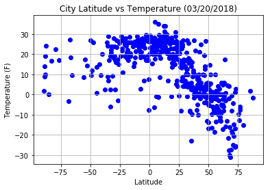
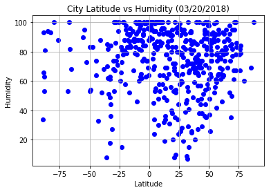
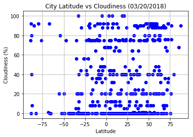
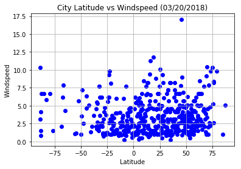

## Unit 6 | Assignment - What's the Weather Like?

## Background

Whether financial, political, or social -- data's true power lies in its ability to answer questions definitively. So let's take what you've learned about Python requests, APIs, and JSON traversals to answer a fundamental question: "What's the weather like as we approach the equator?"

Now, we know what you may be thinking: _"Duh. It gets hotter..."_ 

But, if pressed, how would you **prove** it? 

## WeatherPy


```python
#Dependencies
from config import api_key
from citipy import citipy

import random
import requests
import pandas as pd
import numpy as np
import matplotlib.pyplot as plt
import json
import csv

#plt.style.use("seaborn")
```

## Generate Cities List


```python
#Set Latitudes and Longitudes
latitudes = np.linspace(-89, 89, num=1200)
print(len(latitudes))
```

    1200


```python
longitudes = np.random.uniform(low=-120, high=120, size=(1200,))
print(len(longitudes))
```

    1200


```python
locations = np.column_stack((latitudes, longitudes))
print(len(locations))
```

    1200


```python
cities_df = pd.DataFrame(locations, columns=['Lat', 'Lng'])
cities_df.head()
```


<div>
<style scoped>
    .dataframe tbody tr th:only-of-type {
        vertical-align: middle;
    }

    .dataframe tbody tr th {
        vertical-align: top;
    }

    .dataframe thead th {
        text-align: right;
    }
</style>
<table border="1" class="dataframe">
  <thead>
    <tr style="text-align: right;">
      <th></th>
      <th>Lat</th>
      <th>Lng</th>
    </tr>
  </thead>
  <tbody>
    <tr>
      <th>0</th>
      <td>-89.000000</td>
      <td>114.666322</td>
    </tr>
    <tr>
      <th>1</th>
      <td>-88.851543</td>
      <td>-77.497098</td>
    </tr>
    <tr>
      <th>2</th>
      <td>-88.703086</td>
      <td>-33.937222</td>
    </tr>
    <tr>
      <th>3</th>
      <td>-88.554629</td>
      <td>9.173095</td>
    </tr>
    <tr>
      <th>4</th>
      <td>-88.406172</td>
      <td>7.174989</td>
    </tr>
  </tbody>
</table>
</div>


```python
cities_df['City Name'] = ''
for index, row in cities_df.iterrows():
    city = citipy.nearest_city(row['Lat'], row['Lng'])
    cities_df.loc[index, 'City Name'] = city.city_name   
        
cities_df.head()       
```


<div>
<style scoped>
    .dataframe tbody tr th:only-of-type {
        vertical-align: middle;
    }

    .dataframe tbody tr th {
        vertical-align: top;
    }

    .dataframe thead th {
        text-align: right;
    }
</style>
<table border="1" class="dataframe">
  <thead>
    <tr style="text-align: right;">
      <th></th>
      <th>Lat</th>
      <th>Lng</th>
      <th>City Name</th>
    </tr>
  </thead>
  <tbody>
    <tr>
      <th>0</th>
      <td>-89.000000</td>
      <td>114.666322</td>
      <td>albany</td>
    </tr>
    <tr>
      <th>1</th>
      <td>-88.851543</td>
      <td>-77.497098</td>
      <td>ushuaia</td>
    </tr>
    <tr>
      <th>2</th>
      <td>-88.703086</td>
      <td>-33.937222</td>
      <td>ushuaia</td>
    </tr>
    <tr>
      <th>3</th>
      <td>-88.554629</td>
      <td>9.173095</td>
      <td>hermanus</td>
    </tr>
    <tr>
      <th>4</th>
      <td>-88.406172</td>
      <td>7.174989</td>
      <td>hermanus</td>
    </tr>
  </tbody>
</table>
</div>


```python
#get rid of duplicate cities
cities_df.drop_duplicates(subset='City Name', keep="first", inplace=True)  # 538 rows × 3 columns
cities_df =  cities_df.sample(500) 
cities_df = cities_df.reset_index(drop=True)
cities_df.head()
```


<div>
<style scoped>
    .dataframe tbody tr th:only-of-type {
        vertical-align: middle;
    }

    .dataframe tbody tr th {
        vertical-align: top;
    }

    .dataframe thead th {
        text-align: right;
    }
</style>
<table border="1" class="dataframe">
  <thead>
    <tr style="text-align: right;">
      <th></th>
      <th>Lat</th>
      <th>Lng</th>
      <th>City Name</th>
    </tr>
  </thead>
  <tbody>
    <tr>
      <th>0</th>
      <td>8.833194</td>
      <td>43.048959</td>
      <td>jijiga</td>
    </tr>
    <tr>
      <th>1</th>
      <td>9.278565</td>
      <td>48.754800</td>
      <td>garowe</td>
    </tr>
    <tr>
      <th>2</th>
      <td>4.973311</td>
      <td>-82.366271</td>
      <td>la palma</td>
    </tr>
    <tr>
      <th>3</th>
      <td>-8.833194</td>
      <td>-72.771191</td>
      <td>porto walter</td>
    </tr>
    <tr>
      <th>4</th>
      <td>50.104254</td>
      <td>89.340058</td>
      <td>kosh-agach</td>
    </tr>
  </tbody>
</table>
</div>


## Perform API Calls


```python
#Add columns to cities_df
cities_df['Temperature'] = ''
cities_df['Humidity'] = ''
cities_df['Cloudiness'] = ''
cities_df['WindSpeed'] = ''

cities_df = cities_df[['City Name', 'Lat' ,'Lng', 'Temperature', 'Humidity','Cloudiness', 'WindSpeed']]
cities_df = cities_df.reset_index(drop=True)
cities_df.head()
```


<div>
<style scoped>
    .dataframe tbody tr th:only-of-type {
        vertical-align: middle;
    }

    .dataframe tbody tr th {
        vertical-align: top;
    }

    .dataframe thead th {
        text-align: right;
    }
</style>
<table border="1" class="dataframe">
  <thead>
    <tr style="text-align: right;">
      <th></th>
      <th>City Name</th>
      <th>Lat</th>
      <th>Lng</th>
      <th>Temperature</th>
      <th>Humidity</th>
      <th>Cloudiness</th>
      <th>WindSpeed</th>
    </tr>
  </thead>
  <tbody>
    <tr>
      <th>0</th>
      <td>jijiga</td>
      <td>8.833194</td>
      <td>43.048959</td>
      <td></td>
      <td></td>
      <td></td>
      <td></td>
    </tr>
    <tr>
      <th>1</th>
      <td>garowe</td>
      <td>9.278565</td>
      <td>48.754800</td>
      <td></td>
      <td></td>
      <td></td>
      <td></td>
    </tr>
    <tr>
      <th>2</th>
      <td>la palma</td>
      <td>4.973311</td>
      <td>-82.366271</td>
      <td></td>
      <td></td>
      <td></td>
      <td></td>
    </tr>
    <tr>
      <th>3</th>
      <td>porto walter</td>
      <td>-8.833194</td>
      <td>-72.771191</td>
      <td></td>
      <td></td>
      <td></td>
      <td></td>
    </tr>
    <tr>
      <th>4</th>
      <td>kosh-agach</td>
      <td>50.104254</td>
      <td>89.340058</td>
      <td></td>
      <td></td>
      <td></td>
      <td></td>
    </tr>
  </tbody>
</table>
</div>


```python
# Save config information.
url = "http://api.openweathermap.org/data/2.5/weather?"
units = "metric"
#params = {'appid' : api_key, 'inits' : 'metric'}
query_url = f"{url}appid={api_key}&units={units}&q="

# Loop through cities and get weather data
for index, row in cities_df.iterrows():
    print(f"Weather Data for citi: {row['City Name']}, at index: {index}")
    print("Requested URL: " + (query_url + row['City Name']))
    response = requests.get(query_url + row['City Name']).json()
          
    if response['cod'] == 200: 
          print(response['cod'])
          cities_df.loc[index, 'Temperature'] = response['main']['temp']
          cities_df.loc[index, 'Humidity'] = response['main']['humidity']
          cities_df.loc[index, 'Cloudiness'] = response['clouds']['all'] 
          cities_df.loc[index, 'WindSpeed'] = response['wind']['speed']                                   
    else:
          
          continue
                                                                                       
```

    Weather Data for citi: jijiga, at index: 0
    Requested URL: http://api.openweathermap.org/data/2.5/weather?appid=6b4537a96a4546d4009a9aef9b16ffc3&units=metric&q=jijiga
    200
    Weather Data for citi: garowe, at index: 1
    Requested URL: http://api.openweathermap.org/data/2.5/weather?appid=6b4537a96a4546d4009a9aef9b16ffc3&units=metric&q=garowe
    200
    Weather Data for citi: la palma, at index: 2
    Requested URL: http://api.openweathermap.org/data/2.5/weather?appid=6b4537a96a4546d4009a9aef9b16ffc3&units=metric&q=la palma
    200
    Weather Data for citi: porto walter, at index: 3
    Requested URL: http://api.openweathermap.org/data/2.5/weather?appid=6b4537a96a4546d4009a9aef9b16ffc3&units=metric&q=porto walter
    200
    Weather Data for citi: kosh-agach, at index: 4
    Requested URL: http://api.openweathermap.org/data/2.5/weather?appid=6b4537a96a4546d4009a9aef9b16ffc3&units=metric&q=kosh-agach
    200
    Weather Data for citi: vanavara, at index: 5
    Requested URL: http://api.openweathermap.org/data/2.5/weather?appid=6b4537a96a4546d4009a9aef9b16ffc3&units=metric&q=vanavara
    200
    Weather Data for citi: wajid, at index: 6
    Requested URL: http://api.openweathermap.org/data/2.5/weather?appid=6b4537a96a4546d4009a9aef9b16ffc3&units=metric&q=wajid
    200
    Weather Data for citi: ponta delgada, at index: 7
    Requested URL: http://api.openweathermap.org/data/2.5/weather?appid=6b4537a96a4546d4009a9aef9b16ffc3&units=metric&q=ponta delgada
    200
    Weather Data for citi: leh, at index: 8
    Requested URL: http://api.openweathermap.org/data/2.5/weather?appid=6b4537a96a4546d4009a9aef9b16ffc3&units=metric&q=leh
    200
    Weather Data for citi: blenheim, at index: 9
    Requested URL: http://api.openweathermap.org/data/2.5/weather?appid=6b4537a96a4546d4009a9aef9b16ffc3&units=metric&q=blenheim
    200
    Weather Data for citi: bougouni, at index: 10
    Requested URL: http://api.openweathermap.org/data/2.5/weather?appid=6b4537a96a4546d4009a9aef9b16ffc3&units=metric&q=bougouni
    200
    Weather Data for citi: murgab, at index: 11
    Requested URL: http://api.openweathermap.org/data/2.5/weather?appid=6b4537a96a4546d4009a9aef9b16ffc3&units=metric&q=murgab
    200
    Weather Data for citi: vardo, at index: 12
    Requested URL: http://api.openweathermap.org/data/2.5/weather?appid=6b4537a96a4546d4009a9aef9b16ffc3&units=metric&q=vardo
    200
    Weather Data for citi: borba, at index: 13
    Requested URL: http://api.openweathermap.org/data/2.5/weather?appid=6b4537a96a4546d4009a9aef9b16ffc3&units=metric&q=borba
    200
    Weather Data for citi: ambulu, at index: 14
    Requested URL: http://api.openweathermap.org/data/2.5/weather?appid=6b4537a96a4546d4009a9aef9b16ffc3&units=metric&q=ambulu
    200
    Weather Data for citi: sabalgarh, at index: 15
    Requested URL: http://api.openweathermap.org/data/2.5/weather?appid=6b4537a96a4546d4009a9aef9b16ffc3&units=metric&q=sabalgarh
    200
    Weather Data for citi: dulmen, at index: 16
    Requested URL: http://api.openweathermap.org/data/2.5/weather?appid=6b4537a96a4546d4009a9aef9b16ffc3&units=metric&q=dulmen
    200
    Weather Data for citi: seidu, at index: 17
    Requested URL: http://api.openweathermap.org/data/2.5/weather?appid=6b4537a96a4546d4009a9aef9b16ffc3&units=metric&q=seidu
    200
    Weather Data for citi: niamey, at index: 18
    Requested URL: http://api.openweathermap.org/data/2.5/weather?appid=6b4537a96a4546d4009a9aef9b16ffc3&units=metric&q=niamey
    200
    Weather Data for citi: salinopolis, at index: 19
    Requested URL: http://api.openweathermap.org/data/2.5/weather?appid=6b4537a96a4546d4009a9aef9b16ffc3&units=metric&q=salinopolis
    200
    Weather Data for citi: cap malheureux, at index: 20
    Requested URL: http://api.openweathermap.org/data/2.5/weather?appid=6b4537a96a4546d4009a9aef9b16ffc3&units=metric&q=cap malheureux
    200
    Weather Data for citi: chokwe, at index: 21
    Requested URL: http://api.openweathermap.org/data/2.5/weather?appid=6b4537a96a4546d4009a9aef9b16ffc3&units=metric&q=chokwe
    Weather Data for citi: vokhaikon, at index: 22
    Requested URL: http://api.openweathermap.org/data/2.5/weather?appid=6b4537a96a4546d4009a9aef9b16ffc3&units=metric&q=vokhaikon
    Weather Data for citi: heidelberg, at index: 23
    Requested URL: http://api.openweathermap.org/data/2.5/weather?appid=6b4537a96a4546d4009a9aef9b16ffc3&units=metric&q=heidelberg
    200
    Weather Data for citi: rawson, at index: 24
    Requested URL: http://api.openweathermap.org/data/2.5/weather?appid=6b4537a96a4546d4009a9aef9b16ffc3&units=metric&q=rawson
    200
    Weather Data for citi: carolina, at index: 25
    Requested URL: http://api.openweathermap.org/data/2.5/weather?appid=6b4537a96a4546d4009a9aef9b16ffc3&units=metric&q=carolina
    200
    Weather Data for citi: balaipungut, at index: 26
    Requested URL: http://api.openweathermap.org/data/2.5/weather?appid=6b4537a96a4546d4009a9aef9b16ffc3&units=metric&q=balaipungut
    200
    Weather Data for citi: qaanaaq, at index: 27
    Requested URL: http://api.openweathermap.org/data/2.5/weather?appid=6b4537a96a4546d4009a9aef9b16ffc3&units=metric&q=qaanaaq
    200
    Weather Data for citi: port-de-paix, at index: 28
    Requested URL: http://api.openweathermap.org/data/2.5/weather?appid=6b4537a96a4546d4009a9aef9b16ffc3&units=metric&q=port-de-paix
    Weather Data for citi: le marin, at index: 29
    Requested URL: http://api.openweathermap.org/data/2.5/weather?appid=6b4537a96a4546d4009a9aef9b16ffc3&units=metric&q=le marin
    200
    Weather Data for citi: kruisfontein, at index: 30
    Requested URL: http://api.openweathermap.org/data/2.5/weather?appid=6b4537a96a4546d4009a9aef9b16ffc3&units=metric&q=kruisfontein
    200
    Weather Data for citi: hermanus, at index: 31
    Requested URL: http://api.openweathermap.org/data/2.5/weather?appid=6b4537a96a4546d4009a9aef9b16ffc3&units=metric&q=hermanus
    200
    Weather Data for citi: saint-georges, at index: 32
    Requested URL: http://api.openweathermap.org/data/2.5/weather?appid=6b4537a96a4546d4009a9aef9b16ffc3&units=metric&q=saint-georges
    200
    Weather Data for citi: jining, at index: 33
    Requested URL: http://api.openweathermap.org/data/2.5/weather?appid=6b4537a96a4546d4009a9aef9b16ffc3&units=metric&q=jining
    200
    Weather Data for citi: skagastrond, at index: 34
    Requested URL: http://api.openweathermap.org/data/2.5/weather?appid=6b4537a96a4546d4009a9aef9b16ffc3&units=metric&q=skagastrond
    Weather Data for citi: naryan-mar, at index: 35
    Requested URL: http://api.openweathermap.org/data/2.5/weather?appid=6b4537a96a4546d4009a9aef9b16ffc3&units=metric&q=naryan-mar
    200
    Weather Data for citi: bayevo, at index: 36
    Requested URL: http://api.openweathermap.org/data/2.5/weather?appid=6b4537a96a4546d4009a9aef9b16ffc3&units=metric&q=bayevo
    200
    Weather Data for citi: aketi, at index: 37
    Requested URL: http://api.openweathermap.org/data/2.5/weather?appid=6b4537a96a4546d4009a9aef9b16ffc3&units=metric&q=aketi
    200
    Weather Data for citi: saint-pierre, at index: 38
    Requested URL: http://api.openweathermap.org/data/2.5/weather?appid=6b4537a96a4546d4009a9aef9b16ffc3&units=metric&q=saint-pierre
    200
    Weather Data for citi: paamiut, at index: 39
    Requested URL: http://api.openweathermap.org/data/2.5/weather?appid=6b4537a96a4546d4009a9aef9b16ffc3&units=metric&q=paamiut
    200
    Weather Data for citi: bredasdorp, at index: 40
    Requested URL: http://api.openweathermap.org/data/2.5/weather?appid=6b4537a96a4546d4009a9aef9b16ffc3&units=metric&q=bredasdorp
    200
    Weather Data for citi: lyubeshiv, at index: 41
    Requested URL: http://api.openweathermap.org/data/2.5/weather?appid=6b4537a96a4546d4009a9aef9b16ffc3&units=metric&q=lyubeshiv
    Weather Data for citi: bani, at index: 42
    Requested URL: http://api.openweathermap.org/data/2.5/weather?appid=6b4537a96a4546d4009a9aef9b16ffc3&units=metric&q=bani
    200
    Weather Data for citi: coahuayana, at index: 43
    Requested URL: http://api.openweathermap.org/data/2.5/weather?appid=6b4537a96a4546d4009a9aef9b16ffc3&units=metric&q=coahuayana
    200
    Weather Data for citi: statesboro, at index: 44
    Requested URL: http://api.openweathermap.org/data/2.5/weather?appid=6b4537a96a4546d4009a9aef9b16ffc3&units=metric&q=statesboro
    200
    Weather Data for citi: shache, at index: 45
    Requested URL: http://api.openweathermap.org/data/2.5/weather?appid=6b4537a96a4546d4009a9aef9b16ffc3&units=metric&q=shache
    200
    Weather Data for citi: kavaratti, at index: 46
    Requested URL: http://api.openweathermap.org/data/2.5/weather?appid=6b4537a96a4546d4009a9aef9b16ffc3&units=metric&q=kavaratti
    200
    Weather Data for citi: boffa, at index: 47
    Requested URL: http://api.openweathermap.org/data/2.5/weather?appid=6b4537a96a4546d4009a9aef9b16ffc3&units=metric&q=boffa
    200
    Weather Data for citi: bakaly, at index: 48
    Requested URL: http://api.openweathermap.org/data/2.5/weather?appid=6b4537a96a4546d4009a9aef9b16ffc3&units=metric&q=bakaly
    200
    Weather Data for citi: ayagoz, at index: 49
    Requested URL: http://api.openweathermap.org/data/2.5/weather?appid=6b4537a96a4546d4009a9aef9b16ffc3&units=metric&q=ayagoz
    200
    Weather Data for citi: swellendam, at index: 50
    Requested URL: http://api.openweathermap.org/data/2.5/weather?appid=6b4537a96a4546d4009a9aef9b16ffc3&units=metric&q=swellendam
    200
    Weather Data for citi: itarema, at index: 51
    Requested URL: http://api.openweathermap.org/data/2.5/weather?appid=6b4537a96a4546d4009a9aef9b16ffc3&units=metric&q=itarema
    200
    Weather Data for citi: the valley, at index: 52
    Requested URL: http://api.openweathermap.org/data/2.5/weather?appid=6b4537a96a4546d4009a9aef9b16ffc3&units=metric&q=the valley
    200
    Weather Data for citi: chabahar, at index: 53
    Requested URL: http://api.openweathermap.org/data/2.5/weather?appid=6b4537a96a4546d4009a9aef9b16ffc3&units=metric&q=chabahar
    200
    Weather Data for citi: papasquiaro, at index: 54
    Requested URL: http://api.openweathermap.org/data/2.5/weather?appid=6b4537a96a4546d4009a9aef9b16ffc3&units=metric&q=papasquiaro
    Weather Data for citi: taolanaro, at index: 55
    Requested URL: http://api.openweathermap.org/data/2.5/weather?appid=6b4537a96a4546d4009a9aef9b16ffc3&units=metric&q=taolanaro
    Weather Data for citi: tumannyy, at index: 56
    Requested URL: http://api.openweathermap.org/data/2.5/weather?appid=6b4537a96a4546d4009a9aef9b16ffc3&units=metric&q=tumannyy
    Weather Data for citi: tura, at index: 57
    Requested URL: http://api.openweathermap.org/data/2.5/weather?appid=6b4537a96a4546d4009a9aef9b16ffc3&units=metric&q=tura
    200
    Weather Data for citi: santa marta, at index: 58
    Requested URL: http://api.openweathermap.org/data/2.5/weather?appid=6b4537a96a4546d4009a9aef9b16ffc3&units=metric&q=santa marta
    200
    Weather Data for citi: paraiso, at index: 59
    Requested URL: http://api.openweathermap.org/data/2.5/weather?appid=6b4537a96a4546d4009a9aef9b16ffc3&units=metric&q=paraiso
    200
    Weather Data for citi: peking, at index: 60
    Requested URL: http://api.openweathermap.org/data/2.5/weather?appid=6b4537a96a4546d4009a9aef9b16ffc3&units=metric&q=peking
    200
    Weather Data for citi: kjopsvik, at index: 61
    Requested URL: http://api.openweathermap.org/data/2.5/weather?appid=6b4537a96a4546d4009a9aef9b16ffc3&units=metric&q=kjopsvik
    200
    Weather Data for citi: kaduna, at index: 62
    Requested URL: http://api.openweathermap.org/data/2.5/weather?appid=6b4537a96a4546d4009a9aef9b16ffc3&units=metric&q=kaduna
    200
    Weather Data for citi: jalu, at index: 63
    Requested URL: http://api.openweathermap.org/data/2.5/weather?appid=6b4537a96a4546d4009a9aef9b16ffc3&units=metric&q=jalu
    200
    Weather Data for citi: westpunt, at index: 64
    Requested URL: http://api.openweathermap.org/data/2.5/weather?appid=6b4537a96a4546d4009a9aef9b16ffc3&units=metric&q=westpunt
    Weather Data for citi: saint anthony, at index: 65
    Requested URL: http://api.openweathermap.org/data/2.5/weather?appid=6b4537a96a4546d4009a9aef9b16ffc3&units=metric&q=saint anthony
    200
    Weather Data for citi: hammerfest, at index: 66
    Requested URL: http://api.openweathermap.org/data/2.5/weather?appid=6b4537a96a4546d4009a9aef9b16ffc3&units=metric&q=hammerfest
    200
    Weather Data for citi: luderitz, at index: 67
    Requested URL: http://api.openweathermap.org/data/2.5/weather?appid=6b4537a96a4546d4009a9aef9b16ffc3&units=metric&q=luderitz
    200
    Weather Data for citi: winneba, at index: 68
    Requested URL: http://api.openweathermap.org/data/2.5/weather?appid=6b4537a96a4546d4009a9aef9b16ffc3&units=metric&q=winneba
    200
    Weather Data for citi: carnduff, at index: 69
    Requested URL: http://api.openweathermap.org/data/2.5/weather?appid=6b4537a96a4546d4009a9aef9b16ffc3&units=metric&q=carnduff
    200
    Weather Data for citi: vila velha, at index: 70
    Requested URL: http://api.openweathermap.org/data/2.5/weather?appid=6b4537a96a4546d4009a9aef9b16ffc3&units=metric&q=vila velha
    200
    Weather Data for citi: muncar, at index: 71
    Requested URL: http://api.openweathermap.org/data/2.5/weather?appid=6b4537a96a4546d4009a9aef9b16ffc3&units=metric&q=muncar
    200
    Weather Data for citi: lagoa, at index: 72
    Requested URL: http://api.openweathermap.org/data/2.5/weather?appid=6b4537a96a4546d4009a9aef9b16ffc3&units=metric&q=lagoa
    200
    Weather Data for citi: pisco, at index: 73
    Requested URL: http://api.openweathermap.org/data/2.5/weather?appid=6b4537a96a4546d4009a9aef9b16ffc3&units=metric&q=pisco
    200
    Weather Data for citi: mantua, at index: 74
    Requested URL: http://api.openweathermap.org/data/2.5/weather?appid=6b4537a96a4546d4009a9aef9b16ffc3&units=metric&q=mantua
    200
    Weather Data for citi: beatrice, at index: 75
    Requested URL: http://api.openweathermap.org/data/2.5/weather?appid=6b4537a96a4546d4009a9aef9b16ffc3&units=metric&q=beatrice
    200
    Weather Data for citi: khuzdar, at index: 76
    Requested URL: http://api.openweathermap.org/data/2.5/weather?appid=6b4537a96a4546d4009a9aef9b16ffc3&units=metric&q=khuzdar
    200
    Weather Data for citi: chicontepec, at index: 77
    Requested URL: http://api.openweathermap.org/data/2.5/weather?appid=6b4537a96a4546d4009a9aef9b16ffc3&units=metric&q=chicontepec
    200
    Weather Data for citi: evansville, at index: 78
    Requested URL: http://api.openweathermap.org/data/2.5/weather?appid=6b4537a96a4546d4009a9aef9b16ffc3&units=metric&q=evansville
    200
    Weather Data for citi: pangody, at index: 79
    Requested URL: http://api.openweathermap.org/data/2.5/weather?appid=6b4537a96a4546d4009a9aef9b16ffc3&units=metric&q=pangody
    200
    Weather Data for citi: strezhevoy, at index: 80
    Requested URL: http://api.openweathermap.org/data/2.5/weather?appid=6b4537a96a4546d4009a9aef9b16ffc3&units=metric&q=strezhevoy
    200
    Weather Data for citi: that phanom, at index: 81
    Requested URL: http://api.openweathermap.org/data/2.5/weather?appid=6b4537a96a4546d4009a9aef9b16ffc3&units=metric&q=that phanom
    200
    Weather Data for citi: shablykino, at index: 82
    Requested URL: http://api.openweathermap.org/data/2.5/weather?appid=6b4537a96a4546d4009a9aef9b16ffc3&units=metric&q=shablykino
    200
    Weather Data for citi: toora-khem, at index: 83
    Requested URL: http://api.openweathermap.org/data/2.5/weather?appid=6b4537a96a4546d4009a9aef9b16ffc3&units=metric&q=toora-khem
    200
    Weather Data for citi: saskylakh, at index: 84
    Requested URL: http://api.openweathermap.org/data/2.5/weather?appid=6b4537a96a4546d4009a9aef9b16ffc3&units=metric&q=saskylakh
    200
    Weather Data for citi: aras, at index: 85
    Requested URL: http://api.openweathermap.org/data/2.5/weather?appid=6b4537a96a4546d4009a9aef9b16ffc3&units=metric&q=aras
    200
    Weather Data for citi: mala bilozerka, at index: 86
    Requested URL: http://api.openweathermap.org/data/2.5/weather?appid=6b4537a96a4546d4009a9aef9b16ffc3&units=metric&q=mala bilozerka
    200
    Weather Data for citi: brigantine, at index: 87
    Requested URL: http://api.openweathermap.org/data/2.5/weather?appid=6b4537a96a4546d4009a9aef9b16ffc3&units=metric&q=brigantine
    200
    Weather Data for citi: hay river, at index: 88
    Requested URL: http://api.openweathermap.org/data/2.5/weather?appid=6b4537a96a4546d4009a9aef9b16ffc3&units=metric&q=hay river
    200
    Weather Data for citi: kodinsk, at index: 89
    Requested URL: http://api.openweathermap.org/data/2.5/weather?appid=6b4537a96a4546d4009a9aef9b16ffc3&units=metric&q=kodinsk
    200
    Weather Data for citi: albany, at index: 90
    Requested URL: http://api.openweathermap.org/data/2.5/weather?appid=6b4537a96a4546d4009a9aef9b16ffc3&units=metric&q=albany
    200
    Weather Data for citi: goderich, at index: 91
    Requested URL: http://api.openweathermap.org/data/2.5/weather?appid=6b4537a96a4546d4009a9aef9b16ffc3&units=metric&q=goderich
    200
    Weather Data for citi: yar-sale, at index: 92
    Requested URL: http://api.openweathermap.org/data/2.5/weather?appid=6b4537a96a4546d4009a9aef9b16ffc3&units=metric&q=yar-sale
    200
    Weather Data for citi: ushuaia, at index: 93
    Requested URL: http://api.openweathermap.org/data/2.5/weather?appid=6b4537a96a4546d4009a9aef9b16ffc3&units=metric&q=ushuaia
    200
    Weather Data for citi: ruwi, at index: 94
    Requested URL: http://api.openweathermap.org/data/2.5/weather?appid=6b4537a96a4546d4009a9aef9b16ffc3&units=metric&q=ruwi
    200
    Weather Data for citi: mecca, at index: 95
    Requested URL: http://api.openweathermap.org/data/2.5/weather?appid=6b4537a96a4546d4009a9aef9b16ffc3&units=metric&q=mecca
    200
    Weather Data for citi: miranda, at index: 96
    Requested URL: http://api.openweathermap.org/data/2.5/weather?appid=6b4537a96a4546d4009a9aef9b16ffc3&units=metric&q=miranda
    200
    Weather Data for citi: georgetown, at index: 97
    Requested URL: http://api.openweathermap.org/data/2.5/weather?appid=6b4537a96a4546d4009a9aef9b16ffc3&units=metric&q=georgetown
    200
    Weather Data for citi: bay roberts, at index: 98
    Requested URL: http://api.openweathermap.org/data/2.5/weather?appid=6b4537a96a4546d4009a9aef9b16ffc3&units=metric&q=bay roberts
    200
    Weather Data for citi: manzhouli, at index: 99
    Requested URL: http://api.openweathermap.org/data/2.5/weather?appid=6b4537a96a4546d4009a9aef9b16ffc3&units=metric&q=manzhouli
    200
    Weather Data for citi: cururupu, at index: 100
    Requested URL: http://api.openweathermap.org/data/2.5/weather?appid=6b4537a96a4546d4009a9aef9b16ffc3&units=metric&q=cururupu
    200
    Weather Data for citi: jiuquan, at index: 101
    Requested URL: http://api.openweathermap.org/data/2.5/weather?appid=6b4537a96a4546d4009a9aef9b16ffc3&units=metric&q=jiuquan
    200
    Weather Data for citi: tucurui, at index: 102
    Requested URL: http://api.openweathermap.org/data/2.5/weather?appid=6b4537a96a4546d4009a9aef9b16ffc3&units=metric&q=tucurui
    200
    Weather Data for citi: muisne, at index: 103
    Requested URL: http://api.openweathermap.org/data/2.5/weather?appid=6b4537a96a4546d4009a9aef9b16ffc3&units=metric&q=muisne
    200
    Weather Data for citi: port-gentil, at index: 104
    Requested URL: http://api.openweathermap.org/data/2.5/weather?appid=6b4537a96a4546d4009a9aef9b16ffc3&units=metric&q=port-gentil
    200
    Weather Data for citi: kuching, at index: 105
    Requested URL: http://api.openweathermap.org/data/2.5/weather?appid=6b4537a96a4546d4009a9aef9b16ffc3&units=metric&q=kuching
    200
    Weather Data for citi: champerico, at index: 106
    Requested URL: http://api.openweathermap.org/data/2.5/weather?appid=6b4537a96a4546d4009a9aef9b16ffc3&units=metric&q=champerico
    200
    Weather Data for citi: saint-philippe, at index: 107
    Requested URL: http://api.openweathermap.org/data/2.5/weather?appid=6b4537a96a4546d4009a9aef9b16ffc3&units=metric&q=saint-philippe
    200
    Weather Data for citi: arona, at index: 108
    Requested URL: http://api.openweathermap.org/data/2.5/weather?appid=6b4537a96a4546d4009a9aef9b16ffc3&units=metric&q=arona
    200
    Weather Data for citi: sittingbourne, at index: 109
    Requested URL: http://api.openweathermap.org/data/2.5/weather?appid=6b4537a96a4546d4009a9aef9b16ffc3&units=metric&q=sittingbourne
    200
    Weather Data for citi: iranshahr, at index: 110
    Requested URL: http://api.openweathermap.org/data/2.5/weather?appid=6b4537a96a4546d4009a9aef9b16ffc3&units=metric&q=iranshahr
    200
    Weather Data for citi: kupino, at index: 111
    Requested URL: http://api.openweathermap.org/data/2.5/weather?appid=6b4537a96a4546d4009a9aef9b16ffc3&units=metric&q=kupino
    200
    Weather Data for citi: sao miguel do araguaia, at index: 112
    Requested URL: http://api.openweathermap.org/data/2.5/weather?appid=6b4537a96a4546d4009a9aef9b16ffc3&units=metric&q=sao miguel do araguaia
    200
    Weather Data for citi: ostersund, at index: 113
    Requested URL: http://api.openweathermap.org/data/2.5/weather?appid=6b4537a96a4546d4009a9aef9b16ffc3&units=metric&q=ostersund
    200
    Weather Data for citi: tahta, at index: 114
    Requested URL: http://api.openweathermap.org/data/2.5/weather?appid=6b4537a96a4546d4009a9aef9b16ffc3&units=metric&q=tahta
    Weather Data for citi: clifton, at index: 115
    Requested URL: http://api.openweathermap.org/data/2.5/weather?appid=6b4537a96a4546d4009a9aef9b16ffc3&units=metric&q=clifton
    200
    Weather Data for citi: krasnoselkup, at index: 116
    Requested URL: http://api.openweathermap.org/data/2.5/weather?appid=6b4537a96a4546d4009a9aef9b16ffc3&units=metric&q=krasnoselkup
    Weather Data for citi: honningsvag, at index: 117
    Requested URL: http://api.openweathermap.org/data/2.5/weather?appid=6b4537a96a4546d4009a9aef9b16ffc3&units=metric&q=honningsvag
    200
    Weather Data for citi: manta, at index: 118
    Requested URL: http://api.openweathermap.org/data/2.5/weather?appid=6b4537a96a4546d4009a9aef9b16ffc3&units=metric&q=manta
    200
    Weather Data for citi: jawhar, at index: 119
    Requested URL: http://api.openweathermap.org/data/2.5/weather?appid=6b4537a96a4546d4009a9aef9b16ffc3&units=metric&q=jawhar
    200
    Weather Data for citi: dunmore town, at index: 120
    Requested URL: http://api.openweathermap.org/data/2.5/weather?appid=6b4537a96a4546d4009a9aef9b16ffc3&units=metric&q=dunmore town
    200
    Weather Data for citi: piranhas, at index: 121
    Requested URL: http://api.openweathermap.org/data/2.5/weather?appid=6b4537a96a4546d4009a9aef9b16ffc3&units=metric&q=piranhas
    200
    Weather Data for citi: krasnyy yar, at index: 122
    Requested URL: http://api.openweathermap.org/data/2.5/weather?appid=6b4537a96a4546d4009a9aef9b16ffc3&units=metric&q=krasnyy yar
    200
    Weather Data for citi: ostrovnoy, at index: 123
    Requested URL: http://api.openweathermap.org/data/2.5/weather?appid=6b4537a96a4546d4009a9aef9b16ffc3&units=metric&q=ostrovnoy
    200
    Weather Data for citi: bardiyah, at index: 124
    Requested URL: http://api.openweathermap.org/data/2.5/weather?appid=6b4537a96a4546d4009a9aef9b16ffc3&units=metric&q=bardiyah
    Weather Data for citi: jutai, at index: 125
    Requested URL: http://api.openweathermap.org/data/2.5/weather?appid=6b4537a96a4546d4009a9aef9b16ffc3&units=metric&q=jutai
    200
    Weather Data for citi: kroya, at index: 126
    Requested URL: http://api.openweathermap.org/data/2.5/weather?appid=6b4537a96a4546d4009a9aef9b16ffc3&units=metric&q=kroya
    200
    Weather Data for citi: coquimbo, at index: 127
    Requested URL: http://api.openweathermap.org/data/2.5/weather?appid=6b4537a96a4546d4009a9aef9b16ffc3&units=metric&q=coquimbo
    200
    Weather Data for citi: shahumyan, at index: 128
    Requested URL: http://api.openweathermap.org/data/2.5/weather?appid=6b4537a96a4546d4009a9aef9b16ffc3&units=metric&q=shahumyan
    200
    Weather Data for citi: ochakiv, at index: 129
    Requested URL: http://api.openweathermap.org/data/2.5/weather?appid=6b4537a96a4546d4009a9aef9b16ffc3&units=metric&q=ochakiv
    200
    Weather Data for citi: aktau, at index: 130
    Requested URL: http://api.openweathermap.org/data/2.5/weather?appid=6b4537a96a4546d4009a9aef9b16ffc3&units=metric&q=aktau
    200
    Weather Data for citi: gat, at index: 131
    Requested URL: http://api.openweathermap.org/data/2.5/weather?appid=6b4537a96a4546d4009a9aef9b16ffc3&units=metric&q=gat
    200
    Weather Data for citi: carnarvon, at index: 132
    Requested URL: http://api.openweathermap.org/data/2.5/weather?appid=6b4537a96a4546d4009a9aef9b16ffc3&units=metric&q=carnarvon
    200
    Weather Data for citi: lumphat, at index: 133
    Requested URL: http://api.openweathermap.org/data/2.5/weather?appid=6b4537a96a4546d4009a9aef9b16ffc3&units=metric&q=lumphat
    200
    Weather Data for citi: bakchar, at index: 134
    Requested URL: http://api.openweathermap.org/data/2.5/weather?appid=6b4537a96a4546d4009a9aef9b16ffc3&units=metric&q=bakchar
    200
    Weather Data for citi: cape town, at index: 135
    Requested URL: http://api.openweathermap.org/data/2.5/weather?appid=6b4537a96a4546d4009a9aef9b16ffc3&units=metric&q=cape town
    200
    Weather Data for citi: tarko-sale, at index: 136
    Requested URL: http://api.openweathermap.org/data/2.5/weather?appid=6b4537a96a4546d4009a9aef9b16ffc3&units=metric&q=tarko-sale
    200
    Weather Data for citi: aksu, at index: 137
    Requested URL: http://api.openweathermap.org/data/2.5/weather?appid=6b4537a96a4546d4009a9aef9b16ffc3&units=metric&q=aksu
    200
    Weather Data for citi: talnakh, at index: 138
    Requested URL: http://api.openweathermap.org/data/2.5/weather?appid=6b4537a96a4546d4009a9aef9b16ffc3&units=metric&q=talnakh
    200
    Weather Data for citi: kondinskoye, at index: 139
    Requested URL: http://api.openweathermap.org/data/2.5/weather?appid=6b4537a96a4546d4009a9aef9b16ffc3&units=metric&q=kondinskoye
    200
    Weather Data for citi: guasdualito, at index: 140
    Requested URL: http://api.openweathermap.org/data/2.5/weather?appid=6b4537a96a4546d4009a9aef9b16ffc3&units=metric&q=guasdualito
    200
    Weather Data for citi: castro, at index: 141
    Requested URL: http://api.openweathermap.org/data/2.5/weather?appid=6b4537a96a4546d4009a9aef9b16ffc3&units=metric&q=castro
    200
    Weather Data for citi: cartagena del chaira, at index: 142
    Requested URL: http://api.openweathermap.org/data/2.5/weather?appid=6b4537a96a4546d4009a9aef9b16ffc3&units=metric&q=cartagena del chaira
    200
    Weather Data for citi: clyde river, at index: 143
    Requested URL: http://api.openweathermap.org/data/2.5/weather?appid=6b4537a96a4546d4009a9aef9b16ffc3&units=metric&q=clyde river
    200
    Weather Data for citi: tukrah, at index: 144
    Requested URL: http://api.openweathermap.org/data/2.5/weather?appid=6b4537a96a4546d4009a9aef9b16ffc3&units=metric&q=tukrah
    Weather Data for citi: puerto palomas, at index: 145
    Requested URL: http://api.openweathermap.org/data/2.5/weather?appid=6b4537a96a4546d4009a9aef9b16ffc3&units=metric&q=puerto palomas
    200
    Weather Data for citi: humaita, at index: 146
    Requested URL: http://api.openweathermap.org/data/2.5/weather?appid=6b4537a96a4546d4009a9aef9b16ffc3&units=metric&q=humaita
    200
    Weather Data for citi: pangani, at index: 147
    Requested URL: http://api.openweathermap.org/data/2.5/weather?appid=6b4537a96a4546d4009a9aef9b16ffc3&units=metric&q=pangani
    200
    Weather Data for citi: penzance, at index: 148
    Requested URL: http://api.openweathermap.org/data/2.5/weather?appid=6b4537a96a4546d4009a9aef9b16ffc3&units=metric&q=penzance
    200
    Weather Data for citi: duki, at index: 149
    Requested URL: http://api.openweathermap.org/data/2.5/weather?appid=6b4537a96a4546d4009a9aef9b16ffc3&units=metric&q=duki
    200
    Weather Data for citi: maniitsoq, at index: 150
    Requested URL: http://api.openweathermap.org/data/2.5/weather?appid=6b4537a96a4546d4009a9aef9b16ffc3&units=metric&q=maniitsoq
    200
    Weather Data for citi: ajdabiya, at index: 151
    Requested URL: http://api.openweathermap.org/data/2.5/weather?appid=6b4537a96a4546d4009a9aef9b16ffc3&units=metric&q=ajdabiya
    200
    Weather Data for citi: codrington, at index: 152
    Requested URL: http://api.openweathermap.org/data/2.5/weather?appid=6b4537a96a4546d4009a9aef9b16ffc3&units=metric&q=codrington
    200
    Weather Data for citi: fountain, at index: 153
    Requested URL: http://api.openweathermap.org/data/2.5/weather?appid=6b4537a96a4546d4009a9aef9b16ffc3&units=metric&q=fountain
    200
    Weather Data for citi: tsihombe, at index: 154
    Requested URL: http://api.openweathermap.org/data/2.5/weather?appid=6b4537a96a4546d4009a9aef9b16ffc3&units=metric&q=tsihombe
    Weather Data for citi: el dorado, at index: 155
    Requested URL: http://api.openweathermap.org/data/2.5/weather?appid=6b4537a96a4546d4009a9aef9b16ffc3&units=metric&q=el dorado
    200
    Weather Data for citi: barcelos, at index: 156
    Requested URL: http://api.openweathermap.org/data/2.5/weather?appid=6b4537a96a4546d4009a9aef9b16ffc3&units=metric&q=barcelos
    200
    Weather Data for citi: jaguaruna, at index: 157
    Requested URL: http://api.openweathermap.org/data/2.5/weather?appid=6b4537a96a4546d4009a9aef9b16ffc3&units=metric&q=jaguaruna
    200
    Weather Data for citi: acari, at index: 158
    Requested URL: http://api.openweathermap.org/data/2.5/weather?appid=6b4537a96a4546d4009a9aef9b16ffc3&units=metric&q=acari
    200
    Weather Data for citi: cidreira, at index: 159
    Requested URL: http://api.openweathermap.org/data/2.5/weather?appid=6b4537a96a4546d4009a9aef9b16ffc3&units=metric&q=cidreira
    200
    Weather Data for citi: urucara, at index: 160
    Requested URL: http://api.openweathermap.org/data/2.5/weather?appid=6b4537a96a4546d4009a9aef9b16ffc3&units=metric&q=urucara
    200
    Weather Data for citi: torbay, at index: 161
    Requested URL: http://api.openweathermap.org/data/2.5/weather?appid=6b4537a96a4546d4009a9aef9b16ffc3&units=metric&q=torbay
    200
    Weather Data for citi: baykit, at index: 162
    Requested URL: http://api.openweathermap.org/data/2.5/weather?appid=6b4537a96a4546d4009a9aef9b16ffc3&units=metric&q=baykit
    200
    Weather Data for citi: hami, at index: 163
    Requested URL: http://api.openweathermap.org/data/2.5/weather?appid=6b4537a96a4546d4009a9aef9b16ffc3&units=metric&q=hami
    200
    Weather Data for citi: grand river south east, at index: 164
    Requested URL: http://api.openweathermap.org/data/2.5/weather?appid=6b4537a96a4546d4009a9aef9b16ffc3&units=metric&q=grand river south east
    Weather Data for citi: ocampo, at index: 165
    Requested URL: http://api.openweathermap.org/data/2.5/weather?appid=6b4537a96a4546d4009a9aef9b16ffc3&units=metric&q=ocampo
    200
    Weather Data for citi: jertih, at index: 166
    Requested URL: http://api.openweathermap.org/data/2.5/weather?appid=6b4537a96a4546d4009a9aef9b16ffc3&units=metric&q=jertih
    200
    Weather Data for citi: xining, at index: 167
    Requested URL: http://api.openweathermap.org/data/2.5/weather?appid=6b4537a96a4546d4009a9aef9b16ffc3&units=metric&q=xining
    200
    Weather Data for citi: hofn, at index: 168
    Requested URL: http://api.openweathermap.org/data/2.5/weather?appid=6b4537a96a4546d4009a9aef9b16ffc3&units=metric&q=hofn
    200
    Weather Data for citi: kawalu, at index: 169
    Requested URL: http://api.openweathermap.org/data/2.5/weather?appid=6b4537a96a4546d4009a9aef9b16ffc3&units=metric&q=kawalu
    200
    Weather Data for citi: la sarre, at index: 170
    Requested URL: http://api.openweathermap.org/data/2.5/weather?appid=6b4537a96a4546d4009a9aef9b16ffc3&units=metric&q=la sarre
    200
    Weather Data for citi: pasinler, at index: 171
    Requested URL: http://api.openweathermap.org/data/2.5/weather?appid=6b4537a96a4546d4009a9aef9b16ffc3&units=metric&q=pasinler
    200
    Weather Data for citi: mandera, at index: 172
    Requested URL: http://api.openweathermap.org/data/2.5/weather?appid=6b4537a96a4546d4009a9aef9b16ffc3&units=metric&q=mandera
    200
    Weather Data for citi: lewisburg, at index: 173
    Requested URL: http://api.openweathermap.org/data/2.5/weather?appid=6b4537a96a4546d4009a9aef9b16ffc3&units=metric&q=lewisburg
    200
    Weather Data for citi: diest, at index: 174
    Requested URL: http://api.openweathermap.org/data/2.5/weather?appid=6b4537a96a4546d4009a9aef9b16ffc3&units=metric&q=diest
    200
    Weather Data for citi: chacabuco, at index: 175
    Requested URL: http://api.openweathermap.org/data/2.5/weather?appid=6b4537a96a4546d4009a9aef9b16ffc3&units=metric&q=chacabuco
    200
    Weather Data for citi: tianpeng, at index: 176
    Requested URL: http://api.openweathermap.org/data/2.5/weather?appid=6b4537a96a4546d4009a9aef9b16ffc3&units=metric&q=tianpeng
    200
    Weather Data for citi: davidson, at index: 177
    Requested URL: http://api.openweathermap.org/data/2.5/weather?appid=6b4537a96a4546d4009a9aef9b16ffc3&units=metric&q=davidson
    200
    Weather Data for citi: talara, at index: 178
    Requested URL: http://api.openweathermap.org/data/2.5/weather?appid=6b4537a96a4546d4009a9aef9b16ffc3&units=metric&q=talara
    200
    Weather Data for citi: chany, at index: 179
    Requested URL: http://api.openweathermap.org/data/2.5/weather?appid=6b4537a96a4546d4009a9aef9b16ffc3&units=metric&q=chany
    200
    Weather Data for citi: canmore, at index: 180
    Requested URL: http://api.openweathermap.org/data/2.5/weather?appid=6b4537a96a4546d4009a9aef9b16ffc3&units=metric&q=canmore
    200
    Weather Data for citi: nurota, at index: 181
    Requested URL: http://api.openweathermap.org/data/2.5/weather?appid=6b4537a96a4546d4009a9aef9b16ffc3&units=metric&q=nurota
    200
    Weather Data for citi: messina, at index: 182
    Requested URL: http://api.openweathermap.org/data/2.5/weather?appid=6b4537a96a4546d4009a9aef9b16ffc3&units=metric&q=messina
    200
    Weather Data for citi: high rock, at index: 183
    Requested URL: http://api.openweathermap.org/data/2.5/weather?appid=6b4537a96a4546d4009a9aef9b16ffc3&units=metric&q=high rock
    200
    Weather Data for citi: necochea, at index: 184
    Requested URL: http://api.openweathermap.org/data/2.5/weather?appid=6b4537a96a4546d4009a9aef9b16ffc3&units=metric&q=necochea
    200
    Weather Data for citi: datong, at index: 185
    Requested URL: http://api.openweathermap.org/data/2.5/weather?appid=6b4537a96a4546d4009a9aef9b16ffc3&units=metric&q=datong
    200
    Weather Data for citi: vendome, at index: 186
    Requested URL: http://api.openweathermap.org/data/2.5/weather?appid=6b4537a96a4546d4009a9aef9b16ffc3&units=metric&q=vendome
    200
    Weather Data for citi: walla walla, at index: 187
    Requested URL: http://api.openweathermap.org/data/2.5/weather?appid=6b4537a96a4546d4009a9aef9b16ffc3&units=metric&q=walla walla
    200
    Weather Data for citi: port blair, at index: 188
    Requested URL: http://api.openweathermap.org/data/2.5/weather?appid=6b4537a96a4546d4009a9aef9b16ffc3&units=metric&q=port blair
    200
    Weather Data for citi: busselton, at index: 189
    Requested URL: http://api.openweathermap.org/data/2.5/weather?appid=6b4537a96a4546d4009a9aef9b16ffc3&units=metric&q=busselton
    200
    Weather Data for citi: linhares, at index: 190
    Requested URL: http://api.openweathermap.org/data/2.5/weather?appid=6b4537a96a4546d4009a9aef9b16ffc3&units=metric&q=linhares
    200
    Weather Data for citi: flin flon, at index: 191
    Requested URL: http://api.openweathermap.org/data/2.5/weather?appid=6b4537a96a4546d4009a9aef9b16ffc3&units=metric&q=flin flon
    200
    Weather Data for citi: thinadhoo, at index: 192
    Requested URL: http://api.openweathermap.org/data/2.5/weather?appid=6b4537a96a4546d4009a9aef9b16ffc3&units=metric&q=thinadhoo
    200
    Weather Data for citi: saint-francois, at index: 193
    Requested URL: http://api.openweathermap.org/data/2.5/weather?appid=6b4537a96a4546d4009a9aef9b16ffc3&units=metric&q=saint-francois
    200
    Weather Data for citi: columbus, at index: 194
    Requested URL: http://api.openweathermap.org/data/2.5/weather?appid=6b4537a96a4546d4009a9aef9b16ffc3&units=metric&q=columbus
    200
    Weather Data for citi: nemencine, at index: 195
    Requested URL: http://api.openweathermap.org/data/2.5/weather?appid=6b4537a96a4546d4009a9aef9b16ffc3&units=metric&q=nemencine
    200
    Weather Data for citi: lewistown, at index: 196
    Requested URL: http://api.openweathermap.org/data/2.5/weather?appid=6b4537a96a4546d4009a9aef9b16ffc3&units=metric&q=lewistown
    200
    Weather Data for citi: kidal, at index: 197
    Requested URL: http://api.openweathermap.org/data/2.5/weather?appid=6b4537a96a4546d4009a9aef9b16ffc3&units=metric&q=kidal
    200
    Weather Data for citi: linxia, at index: 198
    Requested URL: http://api.openweathermap.org/data/2.5/weather?appid=6b4537a96a4546d4009a9aef9b16ffc3&units=metric&q=linxia
    200
    Weather Data for citi: dunbar, at index: 199
    Requested URL: http://api.openweathermap.org/data/2.5/weather?appid=6b4537a96a4546d4009a9aef9b16ffc3&units=metric&q=dunbar
    200
    Weather Data for citi: mergui, at index: 200
    Requested URL: http://api.openweathermap.org/data/2.5/weather?appid=6b4537a96a4546d4009a9aef9b16ffc3&units=metric&q=mergui
    Weather Data for citi: valparaiso, at index: 201
    Requested URL: http://api.openweathermap.org/data/2.5/weather?appid=6b4537a96a4546d4009a9aef9b16ffc3&units=metric&q=valparaiso
    200
    Weather Data for citi: catemaco, at index: 202
    Requested URL: http://api.openweathermap.org/data/2.5/weather?appid=6b4537a96a4546d4009a9aef9b16ffc3&units=metric&q=catemaco
    200
    Weather Data for citi: eyl, at index: 203
    Requested URL: http://api.openweathermap.org/data/2.5/weather?appid=6b4537a96a4546d4009a9aef9b16ffc3&units=metric&q=eyl
    200
    Weather Data for citi: belaya glina, at index: 204
    Requested URL: http://api.openweathermap.org/data/2.5/weather?appid=6b4537a96a4546d4009a9aef9b16ffc3&units=metric&q=belaya glina
    200
    Weather Data for citi: mahebourg, at index: 205
    Requested URL: http://api.openweathermap.org/data/2.5/weather?appid=6b4537a96a4546d4009a9aef9b16ffc3&units=metric&q=mahebourg
    200
    Weather Data for citi: amarante do maranhao, at index: 206
    Requested URL: http://api.openweathermap.org/data/2.5/weather?appid=6b4537a96a4546d4009a9aef9b16ffc3&units=metric&q=amarante do maranhao
    200
    Weather Data for citi: backa topola, at index: 207
    Requested URL: http://api.openweathermap.org/data/2.5/weather?appid=6b4537a96a4546d4009a9aef9b16ffc3&units=metric&q=backa topola
    200
    Weather Data for citi: navrongo, at index: 208
    Requested URL: http://api.openweathermap.org/data/2.5/weather?appid=6b4537a96a4546d4009a9aef9b16ffc3&units=metric&q=navrongo
    200
    Weather Data for citi: hearst, at index: 209
    Requested URL: http://api.openweathermap.org/data/2.5/weather?appid=6b4537a96a4546d4009a9aef9b16ffc3&units=metric&q=hearst
    200
    Weather Data for citi: puerto colombia, at index: 210
    Requested URL: http://api.openweathermap.org/data/2.5/weather?appid=6b4537a96a4546d4009a9aef9b16ffc3&units=metric&q=puerto colombia
    200
    Weather Data for citi: sorvag, at index: 211
    Requested URL: http://api.openweathermap.org/data/2.5/weather?appid=6b4537a96a4546d4009a9aef9b16ffc3&units=metric&q=sorvag
    Weather Data for citi: vestmannaeyjar, at index: 212
    Requested URL: http://api.openweathermap.org/data/2.5/weather?appid=6b4537a96a4546d4009a9aef9b16ffc3&units=metric&q=vestmannaeyjar
    200
    Weather Data for citi: shima, at index: 213
    Requested URL: http://api.openweathermap.org/data/2.5/weather?appid=6b4537a96a4546d4009a9aef9b16ffc3&units=metric&q=shima
    200
    Weather Data for citi: balikpapan, at index: 214
    Requested URL: http://api.openweathermap.org/data/2.5/weather?appid=6b4537a96a4546d4009a9aef9b16ffc3&units=metric&q=balikpapan
    200
    Weather Data for citi: bousso, at index: 215
    Requested URL: http://api.openweathermap.org/data/2.5/weather?appid=6b4537a96a4546d4009a9aef9b16ffc3&units=metric&q=bousso
    Weather Data for citi: khatanga, at index: 216
    Requested URL: http://api.openweathermap.org/data/2.5/weather?appid=6b4537a96a4546d4009a9aef9b16ffc3&units=metric&q=khatanga
    200
    Weather Data for citi: opuwo, at index: 217
    Requested URL: http://api.openweathermap.org/data/2.5/weather?appid=6b4537a96a4546d4009a9aef9b16ffc3&units=metric&q=opuwo
    200
    Weather Data for citi: iqaluit, at index: 218
    Requested URL: http://api.openweathermap.org/data/2.5/weather?appid=6b4537a96a4546d4009a9aef9b16ffc3&units=metric&q=iqaluit
    200
    Weather Data for citi: bandarbeyla, at index: 219
    Requested URL: http://api.openweathermap.org/data/2.5/weather?appid=6b4537a96a4546d4009a9aef9b16ffc3&units=metric&q=bandarbeyla
    200
    Weather Data for citi: rangpo, at index: 220
    Requested URL: http://api.openweathermap.org/data/2.5/weather?appid=6b4537a96a4546d4009a9aef9b16ffc3&units=metric&q=rangpo
    200
    Weather Data for citi: montes altos, at index: 221
    Requested URL: http://api.openweathermap.org/data/2.5/weather?appid=6b4537a96a4546d4009a9aef9b16ffc3&units=metric&q=montes altos
    200
    Weather Data for citi: barra patuca, at index: 222
    Requested URL: http://api.openweathermap.org/data/2.5/weather?appid=6b4537a96a4546d4009a9aef9b16ffc3&units=metric&q=barra patuca
    200
    Weather Data for citi: kayerkan, at index: 223
    Requested URL: http://api.openweathermap.org/data/2.5/weather?appid=6b4537a96a4546d4009a9aef9b16ffc3&units=metric&q=kayerkan
    200
    Weather Data for citi: platteville, at index: 224
    Requested URL: http://api.openweathermap.org/data/2.5/weather?appid=6b4537a96a4546d4009a9aef9b16ffc3&units=metric&q=platteville
    200
    Weather Data for citi: palabuhanratu, at index: 225
    Requested URL: http://api.openweathermap.org/data/2.5/weather?appid=6b4537a96a4546d4009a9aef9b16ffc3&units=metric&q=palabuhanratu
    Weather Data for citi: puerto santander, at index: 226
    Requested URL: http://api.openweathermap.org/data/2.5/weather?appid=6b4537a96a4546d4009a9aef9b16ffc3&units=metric&q=puerto santander
    200
    Weather Data for citi: barawe, at index: 227
    Requested URL: http://api.openweathermap.org/data/2.5/weather?appid=6b4537a96a4546d4009a9aef9b16ffc3&units=metric&q=barawe
    Weather Data for citi: muzquiz, at index: 228
    Requested URL: http://api.openweathermap.org/data/2.5/weather?appid=6b4537a96a4546d4009a9aef9b16ffc3&units=metric&q=muzquiz
    Weather Data for citi: rikitea, at index: 229
    Requested URL: http://api.openweathermap.org/data/2.5/weather?appid=6b4537a96a4546d4009a9aef9b16ffc3&units=metric&q=rikitea
    200
    Weather Data for citi: xai-xai, at index: 230
    Requested URL: http://api.openweathermap.org/data/2.5/weather?appid=6b4537a96a4546d4009a9aef9b16ffc3&units=metric&q=xai-xai
    200
    Weather Data for citi: uige, at index: 231
    Requested URL: http://api.openweathermap.org/data/2.5/weather?appid=6b4537a96a4546d4009a9aef9b16ffc3&units=metric&q=uige
    200
    Weather Data for citi: lazurne, at index: 232
    Requested URL: http://api.openweathermap.org/data/2.5/weather?appid=6b4537a96a4546d4009a9aef9b16ffc3&units=metric&q=lazurne
    200
    Weather Data for citi: nara, at index: 233
    Requested URL: http://api.openweathermap.org/data/2.5/weather?appid=6b4537a96a4546d4009a9aef9b16ffc3&units=metric&q=nara
    200
    Weather Data for citi: kyrylivka, at index: 234
    Requested URL: http://api.openweathermap.org/data/2.5/weather?appid=6b4537a96a4546d4009a9aef9b16ffc3&units=metric&q=kyrylivka
    200
    Weather Data for citi: karaul, at index: 235
    Requested URL: http://api.openweathermap.org/data/2.5/weather?appid=6b4537a96a4546d4009a9aef9b16ffc3&units=metric&q=karaul
    Weather Data for citi: emba, at index: 236
    Requested URL: http://api.openweathermap.org/data/2.5/weather?appid=6b4537a96a4546d4009a9aef9b16ffc3&units=metric&q=emba
    200
    Weather Data for citi: san pedro, at index: 237
    Requested URL: http://api.openweathermap.org/data/2.5/weather?appid=6b4537a96a4546d4009a9aef9b16ffc3&units=metric&q=san pedro
    200
    Weather Data for citi: mogzon, at index: 238
    Requested URL: http://api.openweathermap.org/data/2.5/weather?appid=6b4537a96a4546d4009a9aef9b16ffc3&units=metric&q=mogzon
    200
    Weather Data for citi: cerro san antonio, at index: 239
    Requested URL: http://api.openweathermap.org/data/2.5/weather?appid=6b4537a96a4546d4009a9aef9b16ffc3&units=metric&q=cerro san antonio
    Weather Data for citi: sabha, at index: 240
    Requested URL: http://api.openweathermap.org/data/2.5/weather?appid=6b4537a96a4546d4009a9aef9b16ffc3&units=metric&q=sabha
    200
    Weather Data for citi: amderma, at index: 241
    Requested URL: http://api.openweathermap.org/data/2.5/weather?appid=6b4537a96a4546d4009a9aef9b16ffc3&units=metric&q=amderma
    Weather Data for citi: umea, at index: 242
    Requested URL: http://api.openweathermap.org/data/2.5/weather?appid=6b4537a96a4546d4009a9aef9b16ffc3&units=metric&q=umea
    200
    Weather Data for citi: mandurah, at index: 243
    Requested URL: http://api.openweathermap.org/data/2.5/weather?appid=6b4537a96a4546d4009a9aef9b16ffc3&units=metric&q=mandurah
    200
    Weather Data for citi: mayenne, at index: 244
    Requested URL: http://api.openweathermap.org/data/2.5/weather?appid=6b4537a96a4546d4009a9aef9b16ffc3&units=metric&q=mayenne
    200
    Weather Data for citi: dryden, at index: 245
    Requested URL: http://api.openweathermap.org/data/2.5/weather?appid=6b4537a96a4546d4009a9aef9b16ffc3&units=metric&q=dryden
    200
    Weather Data for citi: puerto ayacucho, at index: 246
    Requested URL: http://api.openweathermap.org/data/2.5/weather?appid=6b4537a96a4546d4009a9aef9b16ffc3&units=metric&q=puerto ayacucho
    200
    Weather Data for citi: oussouye, at index: 247
    Requested URL: http://api.openweathermap.org/data/2.5/weather?appid=6b4537a96a4546d4009a9aef9b16ffc3&units=metric&q=oussouye
    200
    Weather Data for citi: turukhansk, at index: 248
    Requested URL: http://api.openweathermap.org/data/2.5/weather?appid=6b4537a96a4546d4009a9aef9b16ffc3&units=metric&q=turukhansk
    200
    Weather Data for citi: hithadhoo, at index: 249
    Requested URL: http://api.openweathermap.org/data/2.5/weather?appid=6b4537a96a4546d4009a9aef9b16ffc3&units=metric&q=hithadhoo
    200
    Weather Data for citi: atar, at index: 250
    Requested URL: http://api.openweathermap.org/data/2.5/weather?appid=6b4537a96a4546d4009a9aef9b16ffc3&units=metric&q=atar
    200
    Weather Data for citi: nicolas de pierola, at index: 251
    Requested URL: http://api.openweathermap.org/data/2.5/weather?appid=6b4537a96a4546d4009a9aef9b16ffc3&units=metric&q=nicolas de pierola
    200
    Weather Data for citi: toropets, at index: 252
    Requested URL: http://api.openweathermap.org/data/2.5/weather?appid=6b4537a96a4546d4009a9aef9b16ffc3&units=metric&q=toropets
    200
    Weather Data for citi: miri, at index: 253
    Requested URL: http://api.openweathermap.org/data/2.5/weather?appid=6b4537a96a4546d4009a9aef9b16ffc3&units=metric&q=miri
    200
    Weather Data for citi: geraldton, at index: 254
    Requested URL: http://api.openweathermap.org/data/2.5/weather?appid=6b4537a96a4546d4009a9aef9b16ffc3&units=metric&q=geraldton
    200
    Weather Data for citi: aksarka, at index: 255
    Requested URL: http://api.openweathermap.org/data/2.5/weather?appid=6b4537a96a4546d4009a9aef9b16ffc3&units=metric&q=aksarka
    200
    Weather Data for citi: husavik, at index: 256
    Requested URL: http://api.openweathermap.org/data/2.5/weather?appid=6b4537a96a4546d4009a9aef9b16ffc3&units=metric&q=husavik
    200
    Weather Data for citi: batouri, at index: 257
    Requested URL: http://api.openweathermap.org/data/2.5/weather?appid=6b4537a96a4546d4009a9aef9b16ffc3&units=metric&q=batouri
    200
    Weather Data for citi: port elizabeth, at index: 258
    Requested URL: http://api.openweathermap.org/data/2.5/weather?appid=6b4537a96a4546d4009a9aef9b16ffc3&units=metric&q=port elizabeth
    200
    Weather Data for citi: taltal, at index: 259
    Requested URL: http://api.openweathermap.org/data/2.5/weather?appid=6b4537a96a4546d4009a9aef9b16ffc3&units=metric&q=taltal
    200
    Weather Data for citi: rijssen, at index: 260
    Requested URL: http://api.openweathermap.org/data/2.5/weather?appid=6b4537a96a4546d4009a9aef9b16ffc3&units=metric&q=rijssen
    200
    Weather Data for citi: dikson, at index: 261
    Requested URL: http://api.openweathermap.org/data/2.5/weather?appid=6b4537a96a4546d4009a9aef9b16ffc3&units=metric&q=dikson
    200
    Weather Data for citi: road town, at index: 262
    Requested URL: http://api.openweathermap.org/data/2.5/weather?appid=6b4537a96a4546d4009a9aef9b16ffc3&units=metric&q=road town
    200
    Weather Data for citi: camopi, at index: 263
    Requested URL: http://api.openweathermap.org/data/2.5/weather?appid=6b4537a96a4546d4009a9aef9b16ffc3&units=metric&q=camopi
    200
    Weather Data for citi: fortuna foothills, at index: 264
    Requested URL: http://api.openweathermap.org/data/2.5/weather?appid=6b4537a96a4546d4009a9aef9b16ffc3&units=metric&q=fortuna foothills
    200
    Weather Data for citi: namibe, at index: 265
    Requested URL: http://api.openweathermap.org/data/2.5/weather?appid=6b4537a96a4546d4009a9aef9b16ffc3&units=metric&q=namibe
    200
    Weather Data for citi: la paz, at index: 266
    Requested URL: http://api.openweathermap.org/data/2.5/weather?appid=6b4537a96a4546d4009a9aef9b16ffc3&units=metric&q=la paz
    200
    Weather Data for citi: los altos, at index: 267
    Requested URL: http://api.openweathermap.org/data/2.5/weather?appid=6b4537a96a4546d4009a9aef9b16ffc3&units=metric&q=los altos
    200
    Weather Data for citi: sirsilla, at index: 268
    Requested URL: http://api.openweathermap.org/data/2.5/weather?appid=6b4537a96a4546d4009a9aef9b16ffc3&units=metric&q=sirsilla
    200
    Weather Data for citi: shahr-e kord, at index: 269
    Requested URL: http://api.openweathermap.org/data/2.5/weather?appid=6b4537a96a4546d4009a9aef9b16ffc3&units=metric&q=shahr-e kord
    200
    Weather Data for citi: deogarh, at index: 270
    Requested URL: http://api.openweathermap.org/data/2.5/weather?appid=6b4537a96a4546d4009a9aef9b16ffc3&units=metric&q=deogarh
    200
    Weather Data for citi: raga, at index: 271
    Requested URL: http://api.openweathermap.org/data/2.5/weather?appid=6b4537a96a4546d4009a9aef9b16ffc3&units=metric&q=raga
    Weather Data for citi: trairi, at index: 272
    Requested URL: http://api.openweathermap.org/data/2.5/weather?appid=6b4537a96a4546d4009a9aef9b16ffc3&units=metric&q=trairi
    200
    Weather Data for citi: grand gaube, at index: 273
    Requested URL: http://api.openweathermap.org/data/2.5/weather?appid=6b4537a96a4546d4009a9aef9b16ffc3&units=metric&q=grand gaube
    200
    Weather Data for citi: zapolyarnyy, at index: 274
    Requested URL: http://api.openweathermap.org/data/2.5/weather?appid=6b4537a96a4546d4009a9aef9b16ffc3&units=metric&q=zapolyarnyy
    200
    Weather Data for citi: nechi, at index: 275
    Requested URL: http://api.openweathermap.org/data/2.5/weather?appid=6b4537a96a4546d4009a9aef9b16ffc3&units=metric&q=nechi
    200
    Weather Data for citi: ribeira grande, at index: 276
    Requested URL: http://api.openweathermap.org/data/2.5/weather?appid=6b4537a96a4546d4009a9aef9b16ffc3&units=metric&q=ribeira grande
    200
    Weather Data for citi: kurumkan, at index: 277
    Requested URL: http://api.openweathermap.org/data/2.5/weather?appid=6b4537a96a4546d4009a9aef9b16ffc3&units=metric&q=kurumkan
    200
    Weather Data for citi: loikaw, at index: 278
    Requested URL: http://api.openweathermap.org/data/2.5/weather?appid=6b4537a96a4546d4009a9aef9b16ffc3&units=metric&q=loikaw
    200
    Weather Data for citi: boundiali, at index: 279
    Requested URL: http://api.openweathermap.org/data/2.5/weather?appid=6b4537a96a4546d4009a9aef9b16ffc3&units=metric&q=boundiali
    200
    Weather Data for citi: media luna, at index: 280
    Requested URL: http://api.openweathermap.org/data/2.5/weather?appid=6b4537a96a4546d4009a9aef9b16ffc3&units=metric&q=media luna
    200
    Weather Data for citi: virginia beach, at index: 281
    Requested URL: http://api.openweathermap.org/data/2.5/weather?appid=6b4537a96a4546d4009a9aef9b16ffc3&units=metric&q=virginia beach
    200
    Weather Data for citi: jamestown, at index: 282
    Requested URL: http://api.openweathermap.org/data/2.5/weather?appid=6b4537a96a4546d4009a9aef9b16ffc3&units=metric&q=jamestown
    200
    Weather Data for citi: beloha, at index: 283
    Requested URL: http://api.openweathermap.org/data/2.5/weather?appid=6b4537a96a4546d4009a9aef9b16ffc3&units=metric&q=beloha
    200
    Weather Data for citi: kalabo, at index: 284
    Requested URL: http://api.openweathermap.org/data/2.5/weather?appid=6b4537a96a4546d4009a9aef9b16ffc3&units=metric&q=kalabo
    200
    Weather Data for citi: gibara, at index: 285
    Requested URL: http://api.openweathermap.org/data/2.5/weather?appid=6b4537a96a4546d4009a9aef9b16ffc3&units=metric&q=gibara
    200
    Weather Data for citi: northam, at index: 286
    Requested URL: http://api.openweathermap.org/data/2.5/weather?appid=6b4537a96a4546d4009a9aef9b16ffc3&units=metric&q=northam
    200
    Weather Data for citi: state college, at index: 287
    Requested URL: http://api.openweathermap.org/data/2.5/weather?appid=6b4537a96a4546d4009a9aef9b16ffc3&units=metric&q=state college
    200
    Weather Data for citi: auka, at index: 288
    Requested URL: http://api.openweathermap.org/data/2.5/weather?appid=6b4537a96a4546d4009a9aef9b16ffc3&units=metric&q=auka
    200
    Weather Data for citi: tarudant, at index: 289
    Requested URL: http://api.openweathermap.org/data/2.5/weather?appid=6b4537a96a4546d4009a9aef9b16ffc3&units=metric&q=tarudant
    Weather Data for citi: horsham, at index: 290
    Requested URL: http://api.openweathermap.org/data/2.5/weather?appid=6b4537a96a4546d4009a9aef9b16ffc3&units=metric&q=horsham
    200
    Weather Data for citi: dwarka, at index: 291
    Requested URL: http://api.openweathermap.org/data/2.5/weather?appid=6b4537a96a4546d4009a9aef9b16ffc3&units=metric&q=dwarka
    200
    Weather Data for citi: bristol, at index: 292
    Requested URL: http://api.openweathermap.org/data/2.5/weather?appid=6b4537a96a4546d4009a9aef9b16ffc3&units=metric&q=bristol
    200
    Weather Data for citi: gornopravdinsk, at index: 293
    Requested URL: http://api.openweathermap.org/data/2.5/weather?appid=6b4537a96a4546d4009a9aef9b16ffc3&units=metric&q=gornopravdinsk
    200
    Weather Data for citi: colborne, at index: 294
    Requested URL: http://api.openweathermap.org/data/2.5/weather?appid=6b4537a96a4546d4009a9aef9b16ffc3&units=metric&q=colborne
    200
    Weather Data for citi: dunda, at index: 295
    Requested URL: http://api.openweathermap.org/data/2.5/weather?appid=6b4537a96a4546d4009a9aef9b16ffc3&units=metric&q=dunda
    200
    Weather Data for citi: lichuan, at index: 296
    Requested URL: http://api.openweathermap.org/data/2.5/weather?appid=6b4537a96a4546d4009a9aef9b16ffc3&units=metric&q=lichuan
    200
    Weather Data for citi: paracuru, at index: 297
    Requested URL: http://api.openweathermap.org/data/2.5/weather?appid=6b4537a96a4546d4009a9aef9b16ffc3&units=metric&q=paracuru
    200
    Weather Data for citi: micheweni, at index: 298
    Requested URL: http://api.openweathermap.org/data/2.5/weather?appid=6b4537a96a4546d4009a9aef9b16ffc3&units=metric&q=micheweni
    200
    Weather Data for citi: gravdal, at index: 299
    Requested URL: http://api.openweathermap.org/data/2.5/weather?appid=6b4537a96a4546d4009a9aef9b16ffc3&units=metric&q=gravdal
    200
    Weather Data for citi: prachuap khiri khan, at index: 300
    Requested URL: http://api.openweathermap.org/data/2.5/weather?appid=6b4537a96a4546d4009a9aef9b16ffc3&units=metric&q=prachuap khiri khan
    200
    Weather Data for citi: sinnamary, at index: 301
    Requested URL: http://api.openweathermap.org/data/2.5/weather?appid=6b4537a96a4546d4009a9aef9b16ffc3&units=metric&q=sinnamary
    200
    Weather Data for citi: ancud, at index: 302
    Requested URL: http://api.openweathermap.org/data/2.5/weather?appid=6b4537a96a4546d4009a9aef9b16ffc3&units=metric&q=ancud
    200
    Weather Data for citi: weymouth, at index: 303
    Requested URL: http://api.openweathermap.org/data/2.5/weather?appid=6b4537a96a4546d4009a9aef9b16ffc3&units=metric&q=weymouth
    200
    Weather Data for citi: chatakonda, at index: 304
    Requested URL: http://api.openweathermap.org/data/2.5/weather?appid=6b4537a96a4546d4009a9aef9b16ffc3&units=metric&q=chatakonda
    200
    Weather Data for citi: chilca, at index: 305
    Requested URL: http://api.openweathermap.org/data/2.5/weather?appid=6b4537a96a4546d4009a9aef9b16ffc3&units=metric&q=chilca
    200
    Weather Data for citi: krasnozerskoye, at index: 306
    Requested URL: http://api.openweathermap.org/data/2.5/weather?appid=6b4537a96a4546d4009a9aef9b16ffc3&units=metric&q=krasnozerskoye
    200
    Weather Data for citi: lasa, at index: 307
    Requested URL: http://api.openweathermap.org/data/2.5/weather?appid=6b4537a96a4546d4009a9aef9b16ffc3&units=metric&q=lasa
    200
    Weather Data for citi: najran, at index: 308
    Requested URL: http://api.openweathermap.org/data/2.5/weather?appid=6b4537a96a4546d4009a9aef9b16ffc3&units=metric&q=najran
    200
    Weather Data for citi: khor, at index: 309
    Requested URL: http://api.openweathermap.org/data/2.5/weather?appid=6b4537a96a4546d4009a9aef9b16ffc3&units=metric&q=khor
    200
    Weather Data for citi: cervo, at index: 310
    Requested URL: http://api.openweathermap.org/data/2.5/weather?appid=6b4537a96a4546d4009a9aef9b16ffc3&units=metric&q=cervo
    200
    Weather Data for citi: balakirevo, at index: 311
    Requested URL: http://api.openweathermap.org/data/2.5/weather?appid=6b4537a96a4546d4009a9aef9b16ffc3&units=metric&q=balakirevo
    200
    Weather Data for citi: mahanoro, at index: 312
    Requested URL: http://api.openweathermap.org/data/2.5/weather?appid=6b4537a96a4546d4009a9aef9b16ffc3&units=metric&q=mahanoro
    200
    Weather Data for citi: maraa, at index: 313
    Requested URL: http://api.openweathermap.org/data/2.5/weather?appid=6b4537a96a4546d4009a9aef9b16ffc3&units=metric&q=maraa
    200
    Weather Data for citi: taoudenni, at index: 314
    Requested URL: http://api.openweathermap.org/data/2.5/weather?appid=6b4537a96a4546d4009a9aef9b16ffc3&units=metric&q=taoudenni
    200
    Weather Data for citi: varna, at index: 315
    Requested URL: http://api.openweathermap.org/data/2.5/weather?appid=6b4537a96a4546d4009a9aef9b16ffc3&units=metric&q=varna
    200
    Weather Data for citi: dakoro, at index: 316
    Requested URL: http://api.openweathermap.org/data/2.5/weather?appid=6b4537a96a4546d4009a9aef9b16ffc3&units=metric&q=dakoro
    200
    Weather Data for citi: port shepstone, at index: 317
    Requested URL: http://api.openweathermap.org/data/2.5/weather?appid=6b4537a96a4546d4009a9aef9b16ffc3&units=metric&q=port shepstone
    200
    Weather Data for citi: cabo san lucas, at index: 318
    Requested URL: http://api.openweathermap.org/data/2.5/weather?appid=6b4537a96a4546d4009a9aef9b16ffc3&units=metric&q=cabo san lucas
    200
    Weather Data for citi: dingle, at index: 319
    Requested URL: http://api.openweathermap.org/data/2.5/weather?appid=6b4537a96a4546d4009a9aef9b16ffc3&units=metric&q=dingle
    200
    Weather Data for citi: ilhabela, at index: 320
    Requested URL: http://api.openweathermap.org/data/2.5/weather?appid=6b4537a96a4546d4009a9aef9b16ffc3&units=metric&q=ilhabela
    200
    Weather Data for citi: bani walid, at index: 321
    Requested URL: http://api.openweathermap.org/data/2.5/weather?appid=6b4537a96a4546d4009a9aef9b16ffc3&units=metric&q=bani walid
    200
    Weather Data for citi: sao jose da coroa grande, at index: 322
    Requested URL: http://api.openweathermap.org/data/2.5/weather?appid=6b4537a96a4546d4009a9aef9b16ffc3&units=metric&q=sao jose da coroa grande
    200
    Weather Data for citi: vila franca do campo, at index: 323
    Requested URL: http://api.openweathermap.org/data/2.5/weather?appid=6b4537a96a4546d4009a9aef9b16ffc3&units=metric&q=vila franca do campo
    200
    Weather Data for citi: polunochnoye, at index: 324
    Requested URL: http://api.openweathermap.org/data/2.5/weather?appid=6b4537a96a4546d4009a9aef9b16ffc3&units=metric&q=polunochnoye
    200
    Weather Data for citi: saldanha, at index: 325
    Requested URL: http://api.openweathermap.org/data/2.5/weather?appid=6b4537a96a4546d4009a9aef9b16ffc3&units=metric&q=saldanha
    200
    Weather Data for citi: lhokseumawe, at index: 326
    Requested URL: http://api.openweathermap.org/data/2.5/weather?appid=6b4537a96a4546d4009a9aef9b16ffc3&units=metric&q=lhokseumawe
    200
    Weather Data for citi: marsh harbour, at index: 327
    Requested URL: http://api.openweathermap.org/data/2.5/weather?appid=6b4537a96a4546d4009a9aef9b16ffc3&units=metric&q=marsh harbour
    200
    Weather Data for citi: sur, at index: 328
    Requested URL: http://api.openweathermap.org/data/2.5/weather?appid=6b4537a96a4546d4009a9aef9b16ffc3&units=metric&q=sur
    200
    Weather Data for citi: arraial do cabo, at index: 329
    Requested URL: http://api.openweathermap.org/data/2.5/weather?appid=6b4537a96a4546d4009a9aef9b16ffc3&units=metric&q=arraial do cabo
    200
    Weather Data for citi: semnan, at index: 330
    Requested URL: http://api.openweathermap.org/data/2.5/weather?appid=6b4537a96a4546d4009a9aef9b16ffc3&units=metric&q=semnan
    200
    Weather Data for citi: ankara, at index: 331
    Requested URL: http://api.openweathermap.org/data/2.5/weather?appid=6b4537a96a4546d4009a9aef9b16ffc3&units=metric&q=ankara
    200
    Weather Data for citi: sao joao da barra, at index: 332
    Requested URL: http://api.openweathermap.org/data/2.5/weather?appid=6b4537a96a4546d4009a9aef9b16ffc3&units=metric&q=sao joao da barra
    200
    Weather Data for citi: vinh, at index: 333
    Requested URL: http://api.openweathermap.org/data/2.5/weather?appid=6b4537a96a4546d4009a9aef9b16ffc3&units=metric&q=vinh
    200
    Weather Data for citi: ilulissat, at index: 334
    Requested URL: http://api.openweathermap.org/data/2.5/weather?appid=6b4537a96a4546d4009a9aef9b16ffc3&units=metric&q=ilulissat
    200
    Weather Data for citi: san felipe, at index: 335
    Requested URL: http://api.openweathermap.org/data/2.5/weather?appid=6b4537a96a4546d4009a9aef9b16ffc3&units=metric&q=san felipe
    200
    Weather Data for citi: dehloran, at index: 336
    Requested URL: http://api.openweathermap.org/data/2.5/weather?appid=6b4537a96a4546d4009a9aef9b16ffc3&units=metric&q=dehloran
    200
    Weather Data for citi: salalah, at index: 337
    Requested URL: http://api.openweathermap.org/data/2.5/weather?appid=6b4537a96a4546d4009a9aef9b16ffc3&units=metric&q=salalah
    200
    Weather Data for citi: micco, at index: 338
    Requested URL: http://api.openweathermap.org/data/2.5/weather?appid=6b4537a96a4546d4009a9aef9b16ffc3&units=metric&q=micco
    200
    Weather Data for citi: batsfjord, at index: 339
    Requested URL: http://api.openweathermap.org/data/2.5/weather?appid=6b4537a96a4546d4009a9aef9b16ffc3&units=metric&q=batsfjord
    200
    Weather Data for citi: jagalur, at index: 340
    Requested URL: http://api.openweathermap.org/data/2.5/weather?appid=6b4537a96a4546d4009a9aef9b16ffc3&units=metric&q=jagalur
    200
    Weather Data for citi: cayenne, at index: 341
    Requested URL: http://api.openweathermap.org/data/2.5/weather?appid=6b4537a96a4546d4009a9aef9b16ffc3&units=metric&q=cayenne
    200
    Weather Data for citi: kyra, at index: 342
    Requested URL: http://api.openweathermap.org/data/2.5/weather?appid=6b4537a96a4546d4009a9aef9b16ffc3&units=metric&q=kyra
    Weather Data for citi: slavgorodskoye, at index: 343
    Requested URL: http://api.openweathermap.org/data/2.5/weather?appid=6b4537a96a4546d4009a9aef9b16ffc3&units=metric&q=slavgorodskoye
    Weather Data for citi: longyearbyen, at index: 344
    Requested URL: http://api.openweathermap.org/data/2.5/weather?appid=6b4537a96a4546d4009a9aef9b16ffc3&units=metric&q=longyearbyen
    200
    Weather Data for citi: norman wells, at index: 345
    Requested URL: http://api.openweathermap.org/data/2.5/weather?appid=6b4537a96a4546d4009a9aef9b16ffc3&units=metric&q=norman wells
    200
    Weather Data for citi: ankazobe, at index: 346
    Requested URL: http://api.openweathermap.org/data/2.5/weather?appid=6b4537a96a4546d4009a9aef9b16ffc3&units=metric&q=ankazobe
    200
    Weather Data for citi: aden, at index: 347
    Requested URL: http://api.openweathermap.org/data/2.5/weather?appid=6b4537a96a4546d4009a9aef9b16ffc3&units=metric&q=aden
    200
    Weather Data for citi: tasiilaq, at index: 348
    Requested URL: http://api.openweathermap.org/data/2.5/weather?appid=6b4537a96a4546d4009a9aef9b16ffc3&units=metric&q=tasiilaq
    200
    Weather Data for citi: santa maria, at index: 349
    Requested URL: http://api.openweathermap.org/data/2.5/weather?appid=6b4537a96a4546d4009a9aef9b16ffc3&units=metric&q=santa maria
    200
    Weather Data for citi: zaraza, at index: 350
    Requested URL: http://api.openweathermap.org/data/2.5/weather?appid=6b4537a96a4546d4009a9aef9b16ffc3&units=metric&q=zaraza
    200
    Weather Data for citi: varnamo, at index: 351
    Requested URL: http://api.openweathermap.org/data/2.5/weather?appid=6b4537a96a4546d4009a9aef9b16ffc3&units=metric&q=varnamo
    200
    Weather Data for citi: mar del plata, at index: 352
    Requested URL: http://api.openweathermap.org/data/2.5/weather?appid=6b4537a96a4546d4009a9aef9b16ffc3&units=metric&q=mar del plata
    200
    Weather Data for citi: chapais, at index: 353
    Requested URL: http://api.openweathermap.org/data/2.5/weather?appid=6b4537a96a4546d4009a9aef9b16ffc3&units=metric&q=chapais
    200
    Weather Data for citi: almaznyy, at index: 354
    Requested URL: http://api.openweathermap.org/data/2.5/weather?appid=6b4537a96a4546d4009a9aef9b16ffc3&units=metric&q=almaznyy
    200
    Weather Data for citi: maryville, at index: 355
    Requested URL: http://api.openweathermap.org/data/2.5/weather?appid=6b4537a96a4546d4009a9aef9b16ffc3&units=metric&q=maryville
    200
    Weather Data for citi: calama, at index: 356
    Requested URL: http://api.openweathermap.org/data/2.5/weather?appid=6b4537a96a4546d4009a9aef9b16ffc3&units=metric&q=calama
    200
    Weather Data for citi: yellowknife, at index: 357
    Requested URL: http://api.openweathermap.org/data/2.5/weather?appid=6b4537a96a4546d4009a9aef9b16ffc3&units=metric&q=yellowknife
    200
    Weather Data for citi: qui nhon, at index: 358
    Requested URL: http://api.openweathermap.org/data/2.5/weather?appid=6b4537a96a4546d4009a9aef9b16ffc3&units=metric&q=qui nhon
    Weather Data for citi: wuwei, at index: 359
    Requested URL: http://api.openweathermap.org/data/2.5/weather?appid=6b4537a96a4546d4009a9aef9b16ffc3&units=metric&q=wuwei
    200
    Weather Data for citi: brae, at index: 360
    Requested URL: http://api.openweathermap.org/data/2.5/weather?appid=6b4537a96a4546d4009a9aef9b16ffc3&units=metric&q=brae
    200
    Weather Data for citi: bozoum, at index: 361
    Requested URL: http://api.openweathermap.org/data/2.5/weather?appid=6b4537a96a4546d4009a9aef9b16ffc3&units=metric&q=bozoum
    200
    Weather Data for citi: palasa, at index: 362
    Requested URL: http://api.openweathermap.org/data/2.5/weather?appid=6b4537a96a4546d4009a9aef9b16ffc3&units=metric&q=palasa
    Weather Data for citi: jizan, at index: 363
    Requested URL: http://api.openweathermap.org/data/2.5/weather?appid=6b4537a96a4546d4009a9aef9b16ffc3&units=metric&q=jizan
    200
    Weather Data for citi: margate, at index: 364
    Requested URL: http://api.openweathermap.org/data/2.5/weather?appid=6b4537a96a4546d4009a9aef9b16ffc3&units=metric&q=margate
    200
    Weather Data for citi: monte escobedo, at index: 365
    Requested URL: http://api.openweathermap.org/data/2.5/weather?appid=6b4537a96a4546d4009a9aef9b16ffc3&units=metric&q=monte escobedo
    200
    Weather Data for citi: campo formoso, at index: 366
    Requested URL: http://api.openweathermap.org/data/2.5/weather?appid=6b4537a96a4546d4009a9aef9b16ffc3&units=metric&q=campo formoso
    200
    Weather Data for citi: saint-augustin, at index: 367
    Requested URL: http://api.openweathermap.org/data/2.5/weather?appid=6b4537a96a4546d4009a9aef9b16ffc3&units=metric&q=saint-augustin
    200
    Weather Data for citi: thompson, at index: 368
    Requested URL: http://api.openweathermap.org/data/2.5/weather?appid=6b4537a96a4546d4009a9aef9b16ffc3&units=metric&q=thompson
    200
    Weather Data for citi: mwene-ditu, at index: 369
    Requested URL: http://api.openweathermap.org/data/2.5/weather?appid=6b4537a96a4546d4009a9aef9b16ffc3&units=metric&q=mwene-ditu
    200
    Weather Data for citi: guarapari, at index: 370
    Requested URL: http://api.openweathermap.org/data/2.5/weather?appid=6b4537a96a4546d4009a9aef9b16ffc3&units=metric&q=guarapari
    200
    Weather Data for citi: jiwani, at index: 371
    Requested URL: http://api.openweathermap.org/data/2.5/weather?appid=6b4537a96a4546d4009a9aef9b16ffc3&units=metric&q=jiwani
    200
    Weather Data for citi: constitucion, at index: 372
    Requested URL: http://api.openweathermap.org/data/2.5/weather?appid=6b4537a96a4546d4009a9aef9b16ffc3&units=metric&q=constitucion
    200
    Weather Data for citi: jian, at index: 373
    Requested URL: http://api.openweathermap.org/data/2.5/weather?appid=6b4537a96a4546d4009a9aef9b16ffc3&units=metric&q=jian
    200
    Weather Data for citi: panjab, at index: 374
    Requested URL: http://api.openweathermap.org/data/2.5/weather?appid=6b4537a96a4546d4009a9aef9b16ffc3&units=metric&q=panjab
    200
    Weather Data for citi: yanchukan, at index: 375
    Requested URL: http://api.openweathermap.org/data/2.5/weather?appid=6b4537a96a4546d4009a9aef9b16ffc3&units=metric&q=yanchukan
    Weather Data for citi: quatre cocos, at index: 376
    Requested URL: http://api.openweathermap.org/data/2.5/weather?appid=6b4537a96a4546d4009a9aef9b16ffc3&units=metric&q=quatre cocos
    200
    Weather Data for citi: ponta do sol, at index: 377
    Requested URL: http://api.openweathermap.org/data/2.5/weather?appid=6b4537a96a4546d4009a9aef9b16ffc3&units=metric&q=ponta do sol
    200
    Weather Data for citi: sibolga, at index: 378
    Requested URL: http://api.openweathermap.org/data/2.5/weather?appid=6b4537a96a4546d4009a9aef9b16ffc3&units=metric&q=sibolga
    200
    Weather Data for citi: bintulu, at index: 379
    Requested URL: http://api.openweathermap.org/data/2.5/weather?appid=6b4537a96a4546d4009a9aef9b16ffc3&units=metric&q=bintulu
    200
    Weather Data for citi: alvand, at index: 380
    Requested URL: http://api.openweathermap.org/data/2.5/weather?appid=6b4537a96a4546d4009a9aef9b16ffc3&units=metric&q=alvand
    200
    Weather Data for citi: turbat, at index: 381
    Requested URL: http://api.openweathermap.org/data/2.5/weather?appid=6b4537a96a4546d4009a9aef9b16ffc3&units=metric&q=turbat
    200
    Weather Data for citi: touros, at index: 382
    Requested URL: http://api.openweathermap.org/data/2.5/weather?appid=6b4537a96a4546d4009a9aef9b16ffc3&units=metric&q=touros
    200
    Weather Data for citi: la ronge, at index: 383
    Requested URL: http://api.openweathermap.org/data/2.5/weather?appid=6b4537a96a4546d4009a9aef9b16ffc3&units=metric&q=la ronge
    200
    Weather Data for citi: bengkulu, at index: 384
    Requested URL: http://api.openweathermap.org/data/2.5/weather?appid=6b4537a96a4546d4009a9aef9b16ffc3&units=metric&q=bengkulu
    Weather Data for citi: vallenar, at index: 385
    Requested URL: http://api.openweathermap.org/data/2.5/weather?appid=6b4537a96a4546d4009a9aef9b16ffc3&units=metric&q=vallenar
    200
    Weather Data for citi: maceio, at index: 386
    Requested URL: http://api.openweathermap.org/data/2.5/weather?appid=6b4537a96a4546d4009a9aef9b16ffc3&units=metric&q=maceio
    200
    Weather Data for citi: kuche, at index: 387
    Requested URL: http://api.openweathermap.org/data/2.5/weather?appid=6b4537a96a4546d4009a9aef9b16ffc3&units=metric&q=kuche
    Weather Data for citi: marsa matruh, at index: 388
    Requested URL: http://api.openweathermap.org/data/2.5/weather?appid=6b4537a96a4546d4009a9aef9b16ffc3&units=metric&q=marsa matruh
    200
    Weather Data for citi: tatarsk, at index: 389
    Requested URL: http://api.openweathermap.org/data/2.5/weather?appid=6b4537a96a4546d4009a9aef9b16ffc3&units=metric&q=tatarsk
    200
    Weather Data for citi: elizabeth city, at index: 390
    Requested URL: http://api.openweathermap.org/data/2.5/weather?appid=6b4537a96a4546d4009a9aef9b16ffc3&units=metric&q=elizabeth city
    200
    Weather Data for citi: sao filipe, at index: 391
    Requested URL: http://api.openweathermap.org/data/2.5/weather?appid=6b4537a96a4546d4009a9aef9b16ffc3&units=metric&q=sao filipe
    200
    Weather Data for citi: mrirt, at index: 392
    Requested URL: http://api.openweathermap.org/data/2.5/weather?appid=6b4537a96a4546d4009a9aef9b16ffc3&units=metric&q=mrirt
    Weather Data for citi: comodoro rivadavia, at index: 393
    Requested URL: http://api.openweathermap.org/data/2.5/weather?appid=6b4537a96a4546d4009a9aef9b16ffc3&units=metric&q=comodoro rivadavia
    200
    Weather Data for citi: adrar, at index: 394
    Requested URL: http://api.openweathermap.org/data/2.5/weather?appid=6b4537a96a4546d4009a9aef9b16ffc3&units=metric&q=adrar
    200
    Weather Data for citi: sorland, at index: 395
    Requested URL: http://api.openweathermap.org/data/2.5/weather?appid=6b4537a96a4546d4009a9aef9b16ffc3&units=metric&q=sorland
    200
    Weather Data for citi: chara, at index: 396
    Requested URL: http://api.openweathermap.org/data/2.5/weather?appid=6b4537a96a4546d4009a9aef9b16ffc3&units=metric&q=chara
    200
    Weather Data for citi: francisco sa, at index: 397
    Requested URL: http://api.openweathermap.org/data/2.5/weather?appid=6b4537a96a4546d4009a9aef9b16ffc3&units=metric&q=francisco sa
    200
    Weather Data for citi: botou, at index: 398
    Requested URL: http://api.openweathermap.org/data/2.5/weather?appid=6b4537a96a4546d4009a9aef9b16ffc3&units=metric&q=botou
    200
    Weather Data for citi: jaroslaw, at index: 399
    Requested URL: http://api.openweathermap.org/data/2.5/weather?appid=6b4537a96a4546d4009a9aef9b16ffc3&units=metric&q=jaroslaw
    200
    Weather Data for citi: orizona, at index: 400
    Requested URL: http://api.openweathermap.org/data/2.5/weather?appid=6b4537a96a4546d4009a9aef9b16ffc3&units=metric&q=orizona
    200
    Weather Data for citi: bar harbor, at index: 401
    Requested URL: http://api.openweathermap.org/data/2.5/weather?appid=6b4537a96a4546d4009a9aef9b16ffc3&units=metric&q=bar harbor
    200
    Weather Data for citi: tucuman, at index: 402
    Requested URL: http://api.openweathermap.org/data/2.5/weather?appid=6b4537a96a4546d4009a9aef9b16ffc3&units=metric&q=tucuman
    200
    Weather Data for citi: maloshuyka, at index: 403
    Requested URL: http://api.openweathermap.org/data/2.5/weather?appid=6b4537a96a4546d4009a9aef9b16ffc3&units=metric&q=maloshuyka
    Weather Data for citi: mana, at index: 404
    Requested URL: http://api.openweathermap.org/data/2.5/weather?appid=6b4537a96a4546d4009a9aef9b16ffc3&units=metric&q=mana
    200
    Weather Data for citi: yangjiang, at index: 405
    Requested URL: http://api.openweathermap.org/data/2.5/weather?appid=6b4537a96a4546d4009a9aef9b16ffc3&units=metric&q=yangjiang
    200
    Weather Data for citi: bulgan, at index: 406
    Requested URL: http://api.openweathermap.org/data/2.5/weather?appid=6b4537a96a4546d4009a9aef9b16ffc3&units=metric&q=bulgan
    200
    Weather Data for citi: guicheng, at index: 407
    Requested URL: http://api.openweathermap.org/data/2.5/weather?appid=6b4537a96a4546d4009a9aef9b16ffc3&units=metric&q=guicheng
    Weather Data for citi: lishui, at index: 408
    Requested URL: http://api.openweathermap.org/data/2.5/weather?appid=6b4537a96a4546d4009a9aef9b16ffc3&units=metric&q=lishui
    200
    Weather Data for citi: punta arenas, at index: 409
    Requested URL: http://api.openweathermap.org/data/2.5/weather?appid=6b4537a96a4546d4009a9aef9b16ffc3&units=metric&q=punta arenas
    200
    Weather Data for citi: caravelas, at index: 410
    Requested URL: http://api.openweathermap.org/data/2.5/weather?appid=6b4537a96a4546d4009a9aef9b16ffc3&units=metric&q=caravelas
    200
    Weather Data for citi: camacha, at index: 411
    Requested URL: http://api.openweathermap.org/data/2.5/weather?appid=6b4537a96a4546d4009a9aef9b16ffc3&units=metric&q=camacha
    200
    Weather Data for citi: upernavik, at index: 412
    Requested URL: http://api.openweathermap.org/data/2.5/weather?appid=6b4537a96a4546d4009a9aef9b16ffc3&units=metric&q=upernavik
    200
    Weather Data for citi: uruguaiana, at index: 413
    Requested URL: http://api.openweathermap.org/data/2.5/weather?appid=6b4537a96a4546d4009a9aef9b16ffc3&units=metric&q=uruguaiana
    200
    Weather Data for citi: falkenberg, at index: 414
    Requested URL: http://api.openweathermap.org/data/2.5/weather?appid=6b4537a96a4546d4009a9aef9b16ffc3&units=metric&q=falkenberg
    200
    Weather Data for citi: bloomfield, at index: 415
    Requested URL: http://api.openweathermap.org/data/2.5/weather?appid=6b4537a96a4546d4009a9aef9b16ffc3&units=metric&q=bloomfield
    200
    Weather Data for citi: marrakesh, at index: 416
    Requested URL: http://api.openweathermap.org/data/2.5/weather?appid=6b4537a96a4546d4009a9aef9b16ffc3&units=metric&q=marrakesh
    200
    Weather Data for citi: kaihua, at index: 417
    Requested URL: http://api.openweathermap.org/data/2.5/weather?appid=6b4537a96a4546d4009a9aef9b16ffc3&units=metric&q=kaihua
    200
    Weather Data for citi: canarana, at index: 418
    Requested URL: http://api.openweathermap.org/data/2.5/weather?appid=6b4537a96a4546d4009a9aef9b16ffc3&units=metric&q=canarana
    200
    Weather Data for citi: gayeri, at index: 419
    Requested URL: http://api.openweathermap.org/data/2.5/weather?appid=6b4537a96a4546d4009a9aef9b16ffc3&units=metric&q=gayeri
    200
    Weather Data for citi: souris, at index: 420
    Requested URL: http://api.openweathermap.org/data/2.5/weather?appid=6b4537a96a4546d4009a9aef9b16ffc3&units=metric&q=souris
    200
    Weather Data for citi: attawapiskat, at index: 421
    Requested URL: http://api.openweathermap.org/data/2.5/weather?appid=6b4537a96a4546d4009a9aef9b16ffc3&units=metric&q=attawapiskat
    Weather Data for citi: san cristobal, at index: 422
    Requested URL: http://api.openweathermap.org/data/2.5/weather?appid=6b4537a96a4546d4009a9aef9b16ffc3&units=metric&q=san cristobal
    200
    Weather Data for citi: shakawe, at index: 423
    Requested URL: http://api.openweathermap.org/data/2.5/weather?appid=6b4537a96a4546d4009a9aef9b16ffc3&units=metric&q=shakawe
    200
    Weather Data for citi: benton harbor, at index: 424
    Requested URL: http://api.openweathermap.org/data/2.5/weather?appid=6b4537a96a4546d4009a9aef9b16ffc3&units=metric&q=benton harbor
    200
    Weather Data for citi: nam tha, at index: 425
    Requested URL: http://api.openweathermap.org/data/2.5/weather?appid=6b4537a96a4546d4009a9aef9b16ffc3&units=metric&q=nam tha
    Weather Data for citi: marcona, at index: 426
    Requested URL: http://api.openweathermap.org/data/2.5/weather?appid=6b4537a96a4546d4009a9aef9b16ffc3&units=metric&q=marcona
    Weather Data for citi: klungkung, at index: 427
    Requested URL: http://api.openweathermap.org/data/2.5/weather?appid=6b4537a96a4546d4009a9aef9b16ffc3&units=metric&q=klungkung
    200
    Weather Data for citi: mezen, at index: 428
    Requested URL: http://api.openweathermap.org/data/2.5/weather?appid=6b4537a96a4546d4009a9aef9b16ffc3&units=metric&q=mezen
    200
    Weather Data for citi: porto velho, at index: 429
    Requested URL: http://api.openweathermap.org/data/2.5/weather?appid=6b4537a96a4546d4009a9aef9b16ffc3&units=metric&q=porto velho
    200
    Weather Data for citi: olafsvik, at index: 430
    Requested URL: http://api.openweathermap.org/data/2.5/weather?appid=6b4537a96a4546d4009a9aef9b16ffc3&units=metric&q=olafsvik
    Weather Data for citi: artyom, at index: 431
    Requested URL: http://api.openweathermap.org/data/2.5/weather?appid=6b4537a96a4546d4009a9aef9b16ffc3&units=metric&q=artyom
    200
    Weather Data for citi: belushya guba, at index: 432
    Requested URL: http://api.openweathermap.org/data/2.5/weather?appid=6b4537a96a4546d4009a9aef9b16ffc3&units=metric&q=belushya guba
    Weather Data for citi: reyes, at index: 433
    Requested URL: http://api.openweathermap.org/data/2.5/weather?appid=6b4537a96a4546d4009a9aef9b16ffc3&units=metric&q=reyes
    200
    Weather Data for citi: nguruka, at index: 434
    Requested URL: http://api.openweathermap.org/data/2.5/weather?appid=6b4537a96a4546d4009a9aef9b16ffc3&units=metric&q=nguruka
    200
    Weather Data for citi: derzhavinsk, at index: 435
    Requested URL: http://api.openweathermap.org/data/2.5/weather?appid=6b4537a96a4546d4009a9aef9b16ffc3&units=metric&q=derzhavinsk
    200
    Weather Data for citi: bom jardim, at index: 436
    Requested URL: http://api.openweathermap.org/data/2.5/weather?appid=6b4537a96a4546d4009a9aef9b16ffc3&units=metric&q=bom jardim
    200
    Weather Data for citi: kasungu, at index: 437
    Requested URL: http://api.openweathermap.org/data/2.5/weather?appid=6b4537a96a4546d4009a9aef9b16ffc3&units=metric&q=kasungu
    200
    Weather Data for citi: bollnas, at index: 438
    Requested URL: http://api.openweathermap.org/data/2.5/weather?appid=6b4537a96a4546d4009a9aef9b16ffc3&units=metric&q=bollnas
    200
    Weather Data for citi: dakar, at index: 439
    Requested URL: http://api.openweathermap.org/data/2.5/weather?appid=6b4537a96a4546d4009a9aef9b16ffc3&units=metric&q=dakar
    200
    Weather Data for citi: jinchang, at index: 440
    Requested URL: http://api.openweathermap.org/data/2.5/weather?appid=6b4537a96a4546d4009a9aef9b16ffc3&units=metric&q=jinchang
    200
    Weather Data for citi: barentsburg, at index: 441
    Requested URL: http://api.openweathermap.org/data/2.5/weather?appid=6b4537a96a4546d4009a9aef9b16ffc3&units=metric&q=barentsburg
    Weather Data for citi: natal, at index: 442
    Requested URL: http://api.openweathermap.org/data/2.5/weather?appid=6b4537a96a4546d4009a9aef9b16ffc3&units=metric&q=natal
    200
    Weather Data for citi: tindwari, at index: 443
    Requested URL: http://api.openweathermap.org/data/2.5/weather?appid=6b4537a96a4546d4009a9aef9b16ffc3&units=metric&q=tindwari
    200
    Weather Data for citi: boyuibe, at index: 444
    Requested URL: http://api.openweathermap.org/data/2.5/weather?appid=6b4537a96a4546d4009a9aef9b16ffc3&units=metric&q=boyuibe
    200
    Weather Data for citi: san, at index: 445
    Requested URL: http://api.openweathermap.org/data/2.5/weather?appid=6b4537a96a4546d4009a9aef9b16ffc3&units=metric&q=san
    200
    Weather Data for citi: puerto ayora, at index: 446
    Requested URL: http://api.openweathermap.org/data/2.5/weather?appid=6b4537a96a4546d4009a9aef9b16ffc3&units=metric&q=puerto ayora
    200
    Weather Data for citi: archidona, at index: 447
    Requested URL: http://api.openweathermap.org/data/2.5/weather?appid=6b4537a96a4546d4009a9aef9b16ffc3&units=metric&q=archidona
    200
    Weather Data for citi: vigrestad, at index: 448
    Requested URL: http://api.openweathermap.org/data/2.5/weather?appid=6b4537a96a4546d4009a9aef9b16ffc3&units=metric&q=vigrestad
    200
    Weather Data for citi: bud, at index: 449
    Requested URL: http://api.openweathermap.org/data/2.5/weather?appid=6b4537a96a4546d4009a9aef9b16ffc3&units=metric&q=bud
    200
    Weather Data for citi: chuy, at index: 450
    Requested URL: http://api.openweathermap.org/data/2.5/weather?appid=6b4537a96a4546d4009a9aef9b16ffc3&units=metric&q=chuy
    200
    Weather Data for citi: locri, at index: 451
    Requested URL: http://api.openweathermap.org/data/2.5/weather?appid=6b4537a96a4546d4009a9aef9b16ffc3&units=metric&q=locri
    200
    Weather Data for citi: bathsheba, at index: 452
    Requested URL: http://api.openweathermap.org/data/2.5/weather?appid=6b4537a96a4546d4009a9aef9b16ffc3&units=metric&q=bathsheba
    200
    Weather Data for citi: san carlos de bariloche, at index: 453
    Requested URL: http://api.openweathermap.org/data/2.5/weather?appid=6b4537a96a4546d4009a9aef9b16ffc3&units=metric&q=san carlos de bariloche
    200
    Weather Data for citi: snyder, at index: 454
    Requested URL: http://api.openweathermap.org/data/2.5/weather?appid=6b4537a96a4546d4009a9aef9b16ffc3&units=metric&q=snyder
    200
    Weather Data for citi: atuona, at index: 455
    Requested URL: http://api.openweathermap.org/data/2.5/weather?appid=6b4537a96a4546d4009a9aef9b16ffc3&units=metric&q=atuona
    200
    Weather Data for citi: jiddah, at index: 456
    Requested URL: http://api.openweathermap.org/data/2.5/weather?appid=6b4537a96a4546d4009a9aef9b16ffc3&units=metric&q=jiddah
    Weather Data for citi: palmas, at index: 457
    Requested URL: http://api.openweathermap.org/data/2.5/weather?appid=6b4537a96a4546d4009a9aef9b16ffc3&units=metric&q=palmas
    200
    Weather Data for citi: rosario, at index: 458
    Requested URL: http://api.openweathermap.org/data/2.5/weather?appid=6b4537a96a4546d4009a9aef9b16ffc3&units=metric&q=rosario
    200
    Weather Data for citi: staszow, at index: 459
    Requested URL: http://api.openweathermap.org/data/2.5/weather?appid=6b4537a96a4546d4009a9aef9b16ffc3&units=metric&q=staszow
    200
    Weather Data for citi: turtkul, at index: 460
    Requested URL: http://api.openweathermap.org/data/2.5/weather?appid=6b4537a96a4546d4009a9aef9b16ffc3&units=metric&q=turtkul
    Weather Data for citi: hualmay, at index: 461
    Requested URL: http://api.openweathermap.org/data/2.5/weather?appid=6b4537a96a4546d4009a9aef9b16ffc3&units=metric&q=hualmay
    200
    Weather Data for citi: vega de alatorre, at index: 462
    Requested URL: http://api.openweathermap.org/data/2.5/weather?appid=6b4537a96a4546d4009a9aef9b16ffc3&units=metric&q=vega de alatorre
    200
    Weather Data for citi: souillac, at index: 463
    Requested URL: http://api.openweathermap.org/data/2.5/weather?appid=6b4537a96a4546d4009a9aef9b16ffc3&units=metric&q=souillac
    200
    Weather Data for citi: east london, at index: 464
    Requested URL: http://api.openweathermap.org/data/2.5/weather?appid=6b4537a96a4546d4009a9aef9b16ffc3&units=metric&q=east london
    200
    Weather Data for citi: areosa, at index: 465
    Requested URL: http://api.openweathermap.org/data/2.5/weather?appid=6b4537a96a4546d4009a9aef9b16ffc3&units=metric&q=areosa
    200
    Weather Data for citi: birin, at index: 466
    Requested URL: http://api.openweathermap.org/data/2.5/weather?appid=6b4537a96a4546d4009a9aef9b16ffc3&units=metric&q=birin
    200
    Weather Data for citi: san patricio, at index: 467
    Requested URL: http://api.openweathermap.org/data/2.5/weather?appid=6b4537a96a4546d4009a9aef9b16ffc3&units=metric&q=san patricio
    200
    Weather Data for citi: cermik, at index: 468
    Requested URL: http://api.openweathermap.org/data/2.5/weather?appid=6b4537a96a4546d4009a9aef9b16ffc3&units=metric&q=cermik
    200
    Weather Data for citi: bandipur, at index: 469
    Requested URL: http://api.openweathermap.org/data/2.5/weather?appid=6b4537a96a4546d4009a9aef9b16ffc3&units=metric&q=bandipur
    200
    Weather Data for citi: lebu, at index: 470
    Requested URL: http://api.openweathermap.org/data/2.5/weather?appid=6b4537a96a4546d4009a9aef9b16ffc3&units=metric&q=lebu
    200
    Weather Data for citi: farias brito, at index: 471
    Requested URL: http://api.openweathermap.org/data/2.5/weather?appid=6b4537a96a4546d4009a9aef9b16ffc3&units=metric&q=farias brito
    200
    Weather Data for citi: barkot, at index: 472
    Requested URL: http://api.openweathermap.org/data/2.5/weather?appid=6b4537a96a4546d4009a9aef9b16ffc3&units=metric&q=barkot
    200
    Weather Data for citi: illoqqortoormiut, at index: 473
    Requested URL: http://api.openweathermap.org/data/2.5/weather?appid=6b4537a96a4546d4009a9aef9b16ffc3&units=metric&q=illoqqortoormiut
    Weather Data for citi: gangotri, at index: 474
    Requested URL: http://api.openweathermap.org/data/2.5/weather?appid=6b4537a96a4546d4009a9aef9b16ffc3&units=metric&q=gangotri
    Weather Data for citi: ventspils, at index: 475
    Requested URL: http://api.openweathermap.org/data/2.5/weather?appid=6b4537a96a4546d4009a9aef9b16ffc3&units=metric&q=ventspils
    200
    Weather Data for citi: wamba, at index: 476
    Requested URL: http://api.openweathermap.org/data/2.5/weather?appid=6b4537a96a4546d4009a9aef9b16ffc3&units=metric&q=wamba
    200
    Weather Data for citi: conde, at index: 477
    Requested URL: http://api.openweathermap.org/data/2.5/weather?appid=6b4537a96a4546d4009a9aef9b16ffc3&units=metric&q=conde
    200
    Weather Data for citi: sabla, at index: 478
    Requested URL: http://api.openweathermap.org/data/2.5/weather?appid=6b4537a96a4546d4009a9aef9b16ffc3&units=metric&q=sabla
    200
    Weather Data for citi: erenhot, at index: 479
    Requested URL: http://api.openweathermap.org/data/2.5/weather?appid=6b4537a96a4546d4009a9aef9b16ffc3&units=metric&q=erenhot
    200
    Weather Data for citi: san carlos, at index: 480
    Requested URL: http://api.openweathermap.org/data/2.5/weather?appid=6b4537a96a4546d4009a9aef9b16ffc3&units=metric&q=san carlos
    200
    Weather Data for citi: klaksvik, at index: 481
    Requested URL: http://api.openweathermap.org/data/2.5/weather?appid=6b4537a96a4546d4009a9aef9b16ffc3&units=metric&q=klaksvik
    200
    Weather Data for citi: aloleng, at index: 482
    Requested URL: http://api.openweathermap.org/data/2.5/weather?appid=6b4537a96a4546d4009a9aef9b16ffc3&units=metric&q=aloleng
    200
    Weather Data for citi: teguldet, at index: 483
    Requested URL: http://api.openweathermap.org/data/2.5/weather?appid=6b4537a96a4546d4009a9aef9b16ffc3&units=metric&q=teguldet
    200
    Weather Data for citi: tena, at index: 484
    Requested URL: http://api.openweathermap.org/data/2.5/weather?appid=6b4537a96a4546d4009a9aef9b16ffc3&units=metric&q=tena
    200
    Weather Data for citi: port hedland, at index: 485
    Requested URL: http://api.openweathermap.org/data/2.5/weather?appid=6b4537a96a4546d4009a9aef9b16ffc3&units=metric&q=port hedland
    200
    Weather Data for citi: ponte, at index: 486
    Requested URL: http://api.openweathermap.org/data/2.5/weather?appid=6b4537a96a4546d4009a9aef9b16ffc3&units=metric&q=ponte
    200
    Weather Data for citi: bayir, at index: 487
    Requested URL: http://api.openweathermap.org/data/2.5/weather?appid=6b4537a96a4546d4009a9aef9b16ffc3&units=metric&q=bayir
    200
    Weather Data for citi: nanortalik, at index: 488
    Requested URL: http://api.openweathermap.org/data/2.5/weather?appid=6b4537a96a4546d4009a9aef9b16ffc3&units=metric&q=nanortalik
    200
    Weather Data for citi: valdivia, at index: 489
    Requested URL: http://api.openweathermap.org/data/2.5/weather?appid=6b4537a96a4546d4009a9aef9b16ffc3&units=metric&q=valdivia
    200
    Weather Data for citi: pierre, at index: 490
    Requested URL: http://api.openweathermap.org/data/2.5/weather?appid=6b4537a96a4546d4009a9aef9b16ffc3&units=metric&q=pierre
    200
    Weather Data for citi: urengoy, at index: 491
    Requested URL: http://api.openweathermap.org/data/2.5/weather?appid=6b4537a96a4546d4009a9aef9b16ffc3&units=metric&q=urengoy
    200
    Weather Data for citi: narsaq, at index: 492
    Requested URL: http://api.openweathermap.org/data/2.5/weather?appid=6b4537a96a4546d4009a9aef9b16ffc3&units=metric&q=narsaq
    200
    Weather Data for citi: pimenta bueno, at index: 493
    Requested URL: http://api.openweathermap.org/data/2.5/weather?appid=6b4537a96a4546d4009a9aef9b16ffc3&units=metric&q=pimenta bueno
    200
    Weather Data for citi: victoria, at index: 494
    Requested URL: http://api.openweathermap.org/data/2.5/weather?appid=6b4537a96a4546d4009a9aef9b16ffc3&units=metric&q=victoria
    200
    Weather Data for citi: buje, at index: 495
    Requested URL: http://api.openweathermap.org/data/2.5/weather?appid=6b4537a96a4546d4009a9aef9b16ffc3&units=metric&q=buje
    200
    Weather Data for citi: cam ranh, at index: 496
    Requested URL: http://api.openweathermap.org/data/2.5/weather?appid=6b4537a96a4546d4009a9aef9b16ffc3&units=metric&q=cam ranh
    200
    Weather Data for citi: enugu, at index: 497
    Requested URL: http://api.openweathermap.org/data/2.5/weather?appid=6b4537a96a4546d4009a9aef9b16ffc3&units=metric&q=enugu
    200
    Weather Data for citi: quelimane, at index: 498
    Requested URL: http://api.openweathermap.org/data/2.5/weather?appid=6b4537a96a4546d4009a9aef9b16ffc3&units=metric&q=quelimane
    200
    Weather Data for citi: shubarkuduk, at index: 499
    Requested URL: http://api.openweathermap.org/data/2.5/weather?appid=6b4537a96a4546d4009a9aef9b16ffc3&units=metric&q=shubarkuduk
    200


```python
#Drop cities with missing information
filter = cities_df['Temperature'] != ''
cities_df = cities_df[filter]
cities_df.head()
```


<div>
<style scoped>
    .dataframe tbody tr th:only-of-type {
        vertical-align: middle;
    }

    .dataframe tbody tr th {
        vertical-align: top;
    }

    .dataframe thead th {
        text-align: right;
    }
</style>
<table border="1" class="dataframe">
  <thead>
    <tr style="text-align: right;">
      <th></th>
      <th>City Name</th>
      <th>Lat</th>
      <th>Lng</th>
      <th>Temperature</th>
      <th>Humidity</th>
      <th>Cloudiness</th>
      <th>WindSpeed</th>
    </tr>
  </thead>
  <tbody>
    <tr>
      <th>0</th>
      <td>jijiga</td>
      <td>8.833194</td>
      <td>43.048959</td>
      <td>8.74</td>
      <td>53</td>
      <td>0</td>
      <td>1.2</td>
    </tr>
    <tr>
      <th>1</th>
      <td>garowe</td>
      <td>9.278565</td>
      <td>48.754800</td>
      <td>18.09</td>
      <td>84</td>
      <td>0</td>
      <td>2.9</td>
    </tr>
    <tr>
      <th>2</th>
      <td>la palma</td>
      <td>4.973311</td>
      <td>-82.366271</td>
      <td>20.04</td>
      <td>99</td>
      <td>12</td>
      <td>0.35</td>
    </tr>
    <tr>
      <th>3</th>
      <td>porto walter</td>
      <td>-8.833194</td>
      <td>-72.771191</td>
      <td>26.54</td>
      <td>82</td>
      <td>8</td>
      <td>0.25</td>
    </tr>
    <tr>
      <th>4</th>
      <td>kosh-agach</td>
      <td>50.104254</td>
      <td>89.340058</td>
      <td>-16.82</td>
      <td>61</td>
      <td>0</td>
      <td>1.15</td>
    </tr>
  </tbody>
</table>
</div>


```python
#Save to CSV
cities_df.to_csv("Cties Weather for 03-20-2018.csv")
```

## Temperature (F) vs. Latitude Plot


```python
x_axis = cities_df['Lat']
data =  cities_df['Temperature']

plt.scatter(x_axis, data, color='blue')
plt.title("City Latitude vs Temperature (03/20/2018)")
plt.xlabel("Latitude")
plt.ylabel("Temperature (F)")
plt.grid()
plt.savefig("city_temp.png")
plt.show

```


    <function matplotlib.pyplot.show>





## Latitude vs Humidity Plot


```python
x_axis = cities_df['Lat']
data =  cities_df['Humidity']

plt.scatter(x_axis, data, color='blue')
plt.title("City Latitude vs Humidity (03/20/2018)")
plt.xlabel("Latitude")
plt.ylabel("Humidity")
plt.grid()
plt.savefig("city_humidity.png")
plt.show
```


    <function matplotlib.pyplot.show>





## Latitude vs. Cloudiness Plot


```python
x_axis = cities_df['Lat']
data =  cities_df['Cloudiness']

plt.scatter(x_axis, data, color='blue')
plt.title("City Latitude vs Cloudiness (03/20/2018)")
plt.xlabel("Latitude")
plt.ylabel("Cloudiness (%)")
plt.grid()
plt.savefig("city_cloudiness.png")
plt.show
```


    <function matplotlib.pyplot.show>





## Latitude vs Windspeed Plot


```python
x_axis = cities_df['Lat']
data =  cities_df['WindSpeed']

plt.scatter(x_axis, data, color='blue')
plt.title("City Latitude vs Windspeed (03/20/2018)")
plt.xlabel("Latitude")
plt.ylabel("Windspeed")
plt.grid()
plt.savefig("city_windspeed.png")
plt.show
```


    <function matplotlib.pyplot.show>





* From the data and graphs above we can conlude that temperature gets hotter as it approaches the equator


```python

```
